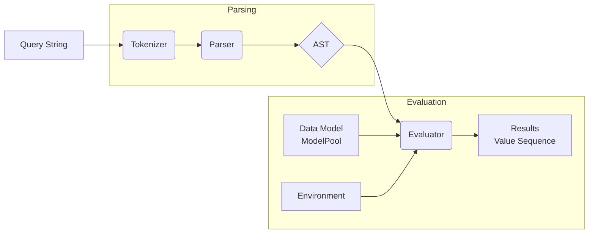
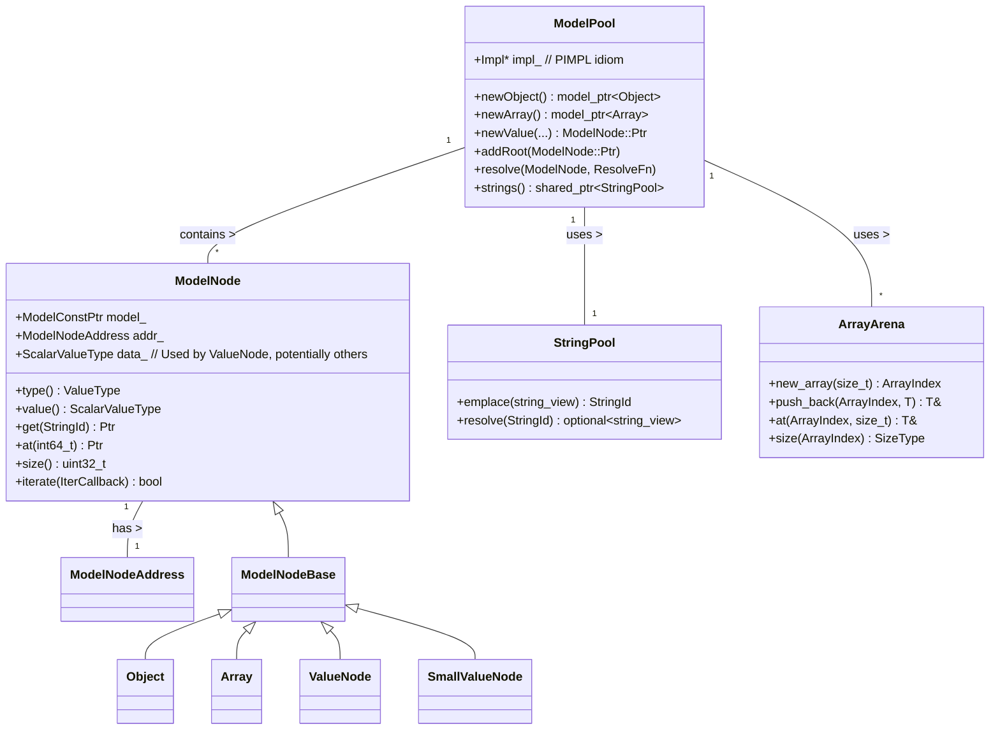
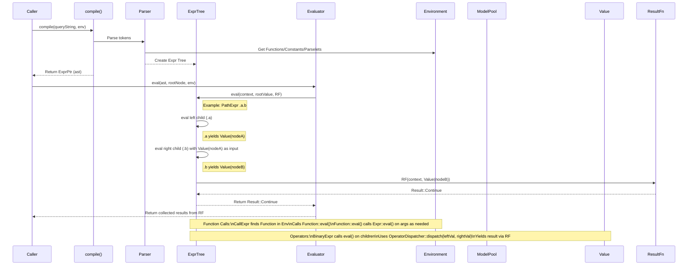

# Simfil Developer Guide

## 1. Overview

### 1.1. Purpose and Scope

Simfil is a C++20 library designed for efficiently querying and manipulating hierarchical data structures, similar to JSON. It provides a concise query language (detailed in `simfil-language.md`) to filter, transform, and extract information from data models.

**Key Features:**

*   **Efficient Data Representation:** Employs a columnar, arena-based storage (`ModelPool`) optimized for memory efficiency, particularly with large datasets containing repetitive structures or values.
*   **Expressive Query Language:** Offers a path-based syntax (`a.b`), functions (`count(...)`), operators (`==`, `+`), and sub-expressions (`{...}`) for complex data navigation and manipulation.
*   **Extensibility:** Supports custom functions and transient data types (`MetaType`) for integrating domain-specific logic.
*   **Performance:** Aims for high performance through optimized data storage and query evaluation.

Simfil is ideal for C++ applications needing to query structured data (e.g., configuration files, API responses, specialized formats) where memory usage and query speed are priorities.

### 1.2. High-Level Architecture

Simfil processes queries through the following stages:

1.  **Tokenization:** The input query string is broken into tokens (`tokenize`).
2.  **Parsing:** Tokens are parsed into an Abstract Syntax Tree (AST) using a Pratt parser (`Parser`).
3.  **Evaluation:** The AST (`Expr` tree) is evaluated against a data model (`ModelNode` within a `ModelPool`). An `Environment` provides context (functions, constants, string interning). Constant sub-expressions may be simplified during this phase.
4.  **Result Generation:** Evaluation yields a sequence of `Value` objects representing the query results.


*Diagram illustrating the flow from query string to results.*

## 2. Setup and Prerequisites

### 2.1. Dependencies

*   **Build System:**
    *   **CMake:** Version 3.19 or higher.
    *   **Conan:** Version 1.62.0 or higher (`required_conan_version = ">=1.62.0"` in `conanfile.py`).
*   **Compiler:** A C++ compiler supporting the C++20 standard (enforced by CMake and Conan).
*   **Core Libraries (Managed by Conan):**
    *   `sfl/[~1]`: Segmented containers library (used for `ArrayArena`).
    *   `fmt/[~10]`: String formatting library.
    *   `bitsery/[~5]`: Serialization library.
    *   `nlohmann_json/[~3]`: JSON library (required if `SIMFIL_WITH_MODEL_JSON=ON`).
*   **Optional Runtime/Development Libraries:**
    *   `catch2/[~3]`: Testing framework (required if `SIMFIL_WITH_TESTS=ON`).
    *   `readline`: Command-line editing library (used by `simfil-repl` if `SIMFIL_WITH_REPL=ON` and available on the system).

### 2.2. Environment Setup

1.  **Install Prerequisites:** Ensure CMake (>=3.19), Conan (>=1.62.0), and a suitable C++20 compiler are installed and accessible in your PATH.
2.  **Clone Repository:** Clone the simfil repository and initialize its submodules:
    ```bash
    git clone <repository-url>
    cd simfil
    git submodule update --init --recursive
    ```
3.  **Install Dependencies:** Use Conan to fetch and install dependencies. A typical workflow involves creating a build directory:
    ```bash
    mkdir build
    cd build
    # Example: Install for Release build
    conan install .. --build=missing -s build_type=Release
    # Example: Install for Debug build
    # conan install .. --build=missing -s build_type=Debug --profile <your_profile>
    ```
    *   Adjust `-s build_type` as needed (e.g., `Release`, `Debug`).
    *   Conan profiles (`--profile`) might be necessary for specific compiler/OS configurations.

### 2.3. Configuration & Building

1.  **Configure with CMake:** From the `build` directory:
    ```bash
    # Example: Configure for Release build
    cmake .. -DCMAKE_TOOLCHAIN_FILE=conan_toolchain.cmake -DCMAKE_BUILD_TYPE=Release

    # Example: Configure for Debug build
    # cmake .. -DCMAKE_TOOLCHAIN_FILE=conan_toolchain.cmake -DCMAKE_BUILD_TYPE=Debug
    ```
    *   Ensure `CMAKE_BUILD_TYPE` matches the `build_type` used during `conan install`.
    *   The `conan_toolchain.cmake` file (generated by `conan install` in the build dir) integrates Conan dependencies.
    *   **CMake Options** (defined in `CMakeLists.txt`):
        *   `SIMFIL_SHARED` (Default: `ON`): Build a shared (`.so`, `.dll`) or static (`.a`, `.lib`) library.
        *   `SIMFIL_FPIC` (Default: `ON`): Enable Position Independent Code (important for static libraries linked into shared libraries).
        *   `SIMFIL_WITH_MODEL_JSON` (Default: `ON`): Include `nlohmann_json` support for JSON parsing/serialization. Requires the `nlohmann_json` Conan dependency.
        *   `SIMFIL_WITH_REPL` (Default: `ON` if main project): Build the `simfil-repl` command-line tool. May require `readline`.
        *   `SIMFIL_WITH_EXAMPLES` (Default: `ON` if main project): Build example programs (e.g., `minimal`).
        *   `SIMFIL_WITH_TESTS` (Default: `ON` if main project): Build the test executable (`test.simfil`). Requires the `catch2` Conan dependency.
        *   `SIMFIL_WITH_COVERAGE` (Default: `OFF` unless GCC/Debug): Enable code coverage instrumentation (requires `gcovr`).
2.  **Build:**
    ```bash
    cmake --build .
    ```
    This compiles the library (e.g., `lib/libsimfil.so`, `bin/simfil.dll`) and any enabled executables (tests, repl, examples) within the `build` directory.

## 3. Core Concepts and Components

### 3.1. Data Model (`simfil::model`)

Simfil's data model is designed for memory efficiency and fast access.

*   **`ModelPool` (`include/simfil/model/model.h`):** The primary container holding the actual data. It uses specialized, columnar storage for different data types (integers, floats, strings, objects, arrays) and manages the lifetime of all nodes. It relies on `ArrayArena` for object/array structures and `StringPool` for field names.
*   **`ModelNode` (`include/simfil/model/nodes.h`):** A lightweight handle or view onto a node within the `ModelPool`. It does *not* own the data but provides an interface to access its type, value, and children. It contains a `ModelNodeAddress` and a `shared_ptr` to its owning `Model` (typically the `ModelPool`).
*   **`ModelNodeAddress` (`include/simfil/model/nodes.h`):** A compact 32-bit identifier encoding a node's location and type within the `ModelPool`. It uses the lower 8 bits for the column ID (type) and the upper 24 bits for an index *or* the value itself (for small value optimization).
*   **`ArrayArena` (`include/simfil/model/arena.h`):** A specialized allocator using `sfl::segmented_vector` to efficiently manage the append-only lists required for object fields and array elements. See [Advanced Topics](#41-model-representation--arena-allocation) for details.
*   **`StringPool` (`include/simfil/model/string-pool.h`):** Interns strings (primarily object keys) using case-insensitive comparison by default. It maps unique strings to `StringId`s (uint16_t), saving memory by storing identical strings only once. `ModelPool` requires a `StringPool` to manage field names.


*Class diagram showing key relationships in the data model.*

### 3.2. Values (`simfil::Value`)

Represents data during query evaluation (`include/simfil/value.h`). A `Value` object can hold:

*   **Primitive Types:** `null` (represented by `std::monostate`), `bool`, `int64_t`, `double`, `std::string`, `std::string_view`.
*   **Model Nodes:** `ModelNode::Ptr` (a smart pointer wrapping a `ModelNode`, referencing data within a `ModelPool`).
*   **Transient Objects:** `TransientObject` (custom types created during evaluation, see [Extensibility](#42-extensibility-functions-and-metatypes)).
*   **Special `Undef` Type:** Represented by the `UndefinedType` struct, distinct from `null`. Used internally, e.g., during constant folding checks.

It uses a `std::variant` internally to store the actual data. `Value` objects are the primary unit of data passed between expression evaluation steps and yielded via the `ResultFn` callback.

### 3.3. Tokenizer (`simfil::tokenize`)

The `tokenize` function (`src/token.cpp`) converts a query string (`std::string_view`) into a `std::vector<Token>` (`include/simfil/token.h`). It identifies:

*   **Keywords:** `and`, `or`, `not`, `as`, `null`, `true`, `false`, `typeof`.
*   **Operators:** `+`, `-`, `*`, `/`, `%`, `==`, `!=`, `<`, `<=`, `>`, `>=`, `.`, `**`, `*`, `&`, `|`, `^`, `~`, `<<`, `>>`, `#`, `?`, `...`.
*   **Literals:** Numbers (integer, float), strings (`'...'`, `"..."`, raw `r'...'`), regular expressions (`re'...'`).
*   **Identifiers/Words:** Field names, function names (e.g., `myField`, `count`).
*   **Punctuation:** `(`, `)`, `[`, `]`, `{`, `}`, `,`, `:`.
*   **Special Symbols:** `_` (self).

### 3.4. Parser (`simfil::Parser`)

Simfil employs a Pratt parser (`src/parser.cpp`, `include/simfil/parser.h`), which efficiently handles operator precedence and associativity.

*   **Parselets:** Parsing logic is associated with tokens:
    *   `PrefixParselet`: Handles tokens starting an expression (e.g., literals, unary `-`, `not`, function names, `(`, `[`).
    *   `InfixParselet`: Handles tokens appearing between operands (e.g., binary `+`, `==`, path `.`, subscript `[`, sub-expression `{`). Each has a `precedence()`.
*   **Process:** The parser consumes tokens and uses registered parselets (stored in `prefixParsers` and `infixParsers` maps) to build the Abstract Syntax Tree (AST). It manages operator precedence by calling `parsePrecedence`.

### 3.5. Expressions (`simfil::Expr`)

The AST consists of nodes inheriting from `simfil::Expr` (`include/simfil/expression.h`). Each `Expr` node represents a part of the query and defines an `eval` method for execution. Key implementations (mostly in `src/simfil.cpp`):

*   `ConstExpr`: A literal value (number, string, boolean, null, transient).
*   `FieldExpr`: Accessing a field by name (e.g., `.foo`, `_`).
*   `WildcardExpr`: Recursive descent (`**`).
*   `AnyChildExpr`: Any direct child (`*`).
*   `PathExpr`: Chained field access (e.g., `.foo.bar`).
*   `SubscriptExpr`: Array/object access by index/key (e.g., `[0]`, `['key']`).
*   `SubExpr`: Filtering sub-expression (`{...}`).
*   `CallExpression`: Function call (e.g., `count(...)`).
*   `BinaryExpr`, `UnaryExpr`: Standard arithmetic, logical, bitwise operations.
*   `UnpackExpr`: Unpack operator (`...`).

### 3.6. Environment (`simfil::Environment`)

Provides the context for parsing and evaluation (`include/simfil/environment.h`). It manages:

*   **Functions:** A map (`functions`) from names to `Function` implementations (case-insensitive lookup).
*   **Constants:** A map (`constants`) from names to constant `Value`s (case-insensitive lookup).
*   **String Pool:** A `shared_ptr<StringPool>` for field name interning. This **must** be the same `StringPool` instance used by the `ModelPool` being queried to ensure correct field lookups.
*   **Runtime Information:** Mechanisms for collecting warnings (`warnings`) and trace data (`traces`).

A `Context` object (`include/simfil/environment.h`) is passed during evaluation, containing a pointer to the `Environment` and the current evaluation `Phase` (`Compilation` or `Evaluation`).

### 3.7. Functions (`simfil::Function`)

Functions (built-in and custom) inherit from `simfil::Function` (`include/simfil/function.h`).

*   **Interface:**
    *   `ident()`: Returns `FnInfo` (name, description, signature) for metadata.
    *   `eval()`: Executes the function's logic. It receives the `Context`, the current input `Value`, a vector of *unevaluated* argument expressions (`std::vector<ExprPtr>`), and a `ResultFn` callback to yield results.
*   **Evaluation:** Functions control *when* and *how* their arguments are evaluated by calling `arg->eval(...)` within their `eval` implementation. This allows for features like short-circuiting or processing arguments lazily.
*   **Registration:** Functions are registered in the `Environment::functions` map. Built-in implementations are in `src/function.cpp`.

**Conceptual Example (`Function::eval`):**
```c++
// Simplified concept for a function like 'myFunc(arg1, arg2)'
Result MyFunc::eval(Context ctx, Value inputVal,
                    const std::vector<ExprPtr>& args,
                    const ResultFn& yieldResult) const {
    // 1. Validate argument count
    if (args.size() != 2) { /* ... throw error ... */ }

    // 2. Evaluate the first argument (arg1) using the input value
    Value arg1Value;
    size_t arg1Count = 0;
    args[0]->eval(ctx, inputVal, LambdaResultFn([&](Context, Value v) {
        // Collect or process result(s) of arg1
        arg1Value = std::move(v);
        arg1Count++;
        return Result::Continue; // Or Stop if needed
    }));
    // Check arg1Count, handle errors if necessary...

    // 3. Evaluate the second argument (arg2) - maybe using arg1's result?
    Value arg2Value;
    // Example: Evaluate arg2 using the *original* input value
    args[1]->eval(ctx, inputVal, LambdaResultFn([&](Context, Value v) {
        arg2Value = std::move(v);
        return Result::Continue;
    }));

    // 4. Compute the function's final result(s) based on evaluated args
    Value finalResult = /* ... compute using arg1Value, arg2Value ... */;

    // 5. Yield the final result(s)
    return yieldResult(ctx, std::move(finalResult));
}
```

### 3.8. Operators (`simfil::Operator*`)

Operators (`+`, `-`, `==`, etc.) use a template-based dispatch mechanism (`include/simfil/operator.h`).

*   **Operator Structs:** Each operator (e.g., `OperatorAdd`, `OperatorEq`) is a struct defining `operator()` overloads for valid combinations of primitive C++ types (corresponding to `Value` types).
*   **Dispatchers:** `UnaryOperatorDispatcher` and `BinaryOperatorDispatcher` are template classes parameterized by an operator struct (e.g., `BinaryOperatorDispatcher<OperatorAdd>`). Their static `dispatch` methods accept `Value` objects.
*   **Runtime Type Handling:** Inside `dispatch`, `std::visit` inspects the `std::variant` within the input `Value`(s) to determine the runtime types.
*   **Execution:** The appropriate `operator()` overload from the operator struct is invoked (e.g., `OperatorAdd()(int64_t_value, double_value)`).
*   **Error Handling:** If no matching overload exists, a special `InvalidOperands` type is returned internally, which the dispatcher catches and converts into an `InvalidOperandsError` exception or a runtime error message detailing the type mismatch.
*   **Transient Objects:** If an operand is a `TransientObject`, the dispatcher calls the `unaryOp` or `binaryOp` method defined by its `MetaType`.

This design separates operator logic from `Expr` evaluation and provides systematic type checking.

### 3.9. Evaluation Flow

Evaluation, typically initiated by `simfil::eval`, proceeds as follows:

1.  **Start:** Evaluation begins at the root of the AST (`ExprPtr`).
2.  **Recursion:** Each `Expr` node's `eval` method is called recursively. `eval` receives the `Context`, the current input `Value` (representing the data context for that step), and a `ResultFn` callback.
3.  **Data Flow Example (Path):** For `a.b`, the `PathExpr` first evaluates `a` using the initial input `Value`. For *each* `Value` yielded by `a`, it then evaluates `b` using that yielded value as the *new* input `Value`. Results from evaluating `b` are yielded via the `ResultFn`.
4.  **Operator Evaluation:** `BinaryExpr<Op>` evaluates its left child, then its right child. For each pair of resulting `Value`s (one from left, one from right), it calls `BinaryOperatorDispatcher<Op>::dispatch(leftValue, rightValue)` and yields the computed result via `ResultFn`.
5.  **Function Evaluation:** `CallExpression` finds the `Function*` in the `Environment` and calls its `eval` method, passing the *unevaluated* argument `ExprPtr`s. The function implementation controls argument evaluation.
6.  **Result Yielding:** All evaluation paths ultimately yield results by invoking the `ResultFn` callback. A single `Expr::eval` call might invoke the callback multiple times (e.g., iterating over an array).
7.  **Control Flow:** The `ResultFn` returns `Result::Continue` or `Result::Stop`, allowing early termination (used by functions like `any`, `each`, or the final result collector).

**Simple Query Example Trace (`.a.b == 3`):**

1.  `eval` starts with the `BinaryExpr<OperatorEq>`.
2.  Left child (`PathExpr` for `.a.b`) is evaluated with the initial input `Value` (root node).
    *   `.a` is evaluated, yielding `Value(nodeA)`.
    *   `.b` is evaluated with `Value(nodeA)` as input, yielding `Value(nodeB)`.
3.  Right child (`ConstExpr` for `3`) is evaluated, yielding `Value(3)`.
4.  `BinaryOperatorDispatcher<OperatorEq>::dispatch(Value(nodeB), Value(3))` is called.
    *   Assume `nodeB` holds the integer `3`. The dispatcher calls `OperatorEq()(int64_t(3), int64_t(3))`.
    *   This returns `true`.
5.  The `ResultFn` is called with `Value(true)`.


*Sequence diagram illustrating the evaluation process.*

## 4. Advanced Topics

### 4.1. Model Representation & Arena Allocation

Simfil's `ModelPool` optimizes memory usage for large, potentially repetitive JSON-like structures.

**Columnar Storage:** `ModelPool` uses separate containers (columns) for different data types (`int64_t`, `double`, `string`, object structures, array structures) rather than storing each node contiguously. This improves data locality for type-specific operations and enables efficient storage techniques.

**`ModelNodeAddress` (`include/simfil/model/nodes.h`):** This compact 32-bit struct identifies a node's type and location:
```c++
struct ModelNodeAddress {
    uint32_t value_ = 0;
    // Lower 8 bits: Column ID (e.g., Model::Objects, Model::Int64, Model::Bool)
    [[nodiscard]] uint8_t column() const;
    // Upper 24 bits: Index into column OR the value itself
    [[nodiscard]] uint32_t index() const;
    // Accessors for small value optimization
    [[nodiscard]] uint16_t uint16() const; // For UInt16, Bool
    [[nodiscard]] int16_t int16() const;  // For Int16
};
```
*   **Small Value Optimization:** `Bool`, `Int16`, `UInt16`, and `Null` types store their value/presence directly within the `ModelNodeAddress` (using the upper 24 bits and specific `column()` IDs), avoiding separate memory allocation.
*   **Column Index:** For larger types (`Objects`, `Arrays`, `Int64`, `Double`, `String`), the `index()` part points into the corresponding storage vector within the `ModelPool` (e.g., `ModelPool::Impl::columns_.i64_`, `ModelPool::Impl::columns_.objectMemberArrays_`).

**`ArrayArena` (`include/simfil/model/arena.h`):** This specialized allocator manages the storage for object fields and array elements.
```c++
// Simplified structure
template <class ElementType, size_t PageSize, ...>
class ArrayArena {
    struct Chunk { /* ... metadata ... */ };
    sfl::segmented_vector<Chunk, ...> heads_;         // Metadata for each array start
    sfl::segmented_vector<Chunk, ...> continuations_; // Additional chunks for growth
    sfl::segmented_vector<ElementType, PageSize> data_; // Actual element storage
    // Optional thread safety via std::shared_mutex
};
```
*   **Segmented Storage:** Uses `sfl::segmented_vector` to allocate memory in fixed-size pages (segments), reducing fragmentation and reallocation overhead compared to `std::vector`.
*   **Chunk Linking:** Each logical array (object fields or array elements) is represented as a linked list of `Chunk`s. The first chunk is in `heads_`, subsequent chunks (allocated when needed) are in `continuations_`. This allows arrays to grow efficiently without moving existing data.
*   **Append Efficiency:** Appending often only involves adding an element to the current last chunk's space in `data_`. Allocating a new, larger chunk only happens when the current one is full.
*   **Access/Iteration:** Accessing elements by index or iterating involves traversing the linked list of chunks.

This combination of columnar storage, small value optimization, and arena allocation makes `ModelPool` memory-efficient and performant for its target data structures.

### 4.2. Extensibility: Functions and MetaTypes

Simfil can be extended with custom logic:

**1. Custom Functions:**

*   **Interface:** Inherit from `simfil::Function` (`include/simfil/function.h`). Implement `ident()` for metadata and `eval()` for logic.
*   **`eval` Signature:**
    ```c++
    virtual auto eval(Context ctx, Value inputVal,
                      const std::vector<ExprPtr>& args, // Unevaluated arguments
                      const ResultFn& yieldResult) const -> Result = 0;
    ```
*   **Argument Evaluation:** The `eval` implementation controls *how* and *when* arguments (`args`) are evaluated using `arg->eval(...)`. This allows for lazy evaluation, short-circuiting, etc.
*   **Result Yielding:** Use the `yieldResult` callback to return one or more `Value`s.
*   **Registration:** Add an instance of your function to `Environment::functions`.
*   **Example:** See the conceptual example in [Section 3.7](#37-functions-simfilfunction).

**2. Custom Transient Data Types (`MetaType`):**

Simfil supports temporary, custom data types created during evaluation (e.g., `IRange`, `Re` for ranges and regexes). These are represented by `TransientObject`s managed by a `MetaType`.

*   **`MetaType` Interface (`include/simfil/transient.h`):** Defines the behavior:
    *   `ident`: The type name (e.g., "irange").
    *   Memory Management: `init()`, `copy(void*)`, `deinit(void*)` for the custom data payload (`void*`).
    *   Operator Overloading: `unaryOp(...)`, `binaryOp(...)` define how the type interacts with simfil operators.
    *   Unpacking: `unpack(...)` defines behavior for the `...` operator.
*   **`TransientObject`:** A wrapper stored in a `Value`, holding a pointer to the `MetaType` singleton and the `void*` data payload.
*   **`TypedMetaType` Helper (`include/simfil/typed-meta-type.h`):** A CRTP base class simplifying `MetaType` implementation for a specific C++ struct/class `T`. It handles memory management (`new`/`delete`) and provides strongly-typed signatures for operator/unpack methods (e.g., `unaryOp(std::string_view opName, const T& self)`).
*   **Usage:**
    1.  Define your data struct (e.g., `MyData`).
    2.  Define a class `MyDataType : public TypedMetaType<MyData>` implementing the required methods (operators, unpack). Define a static singleton instance (`MyDataType::Type`).
    3.  Create a factory function (e.g., `makeMyData(...) -> Value`) that constructs a `TransientObject(&MyDataType::Type)` and initializes its data.
    4.  Register a simfil function (e.g., `myDataFunc`) that calls this factory.
    5.  When a `Value` containing this `TransientObject` is used in an operation, the `OperatorDispatcher` calls the corresponding method on `MyDataType::Type`.

**Conceptual Example (`MetaType` for a simple Point):**
```c++
// 1. Data Struct
struct PointData { double x = 0, y = 0; };

// 2. MetaType Implementation
class PointType : public simfil::TypedMetaType<PointData> {
public:
    static PointType Type; // Singleton
    PointType() : TypedMetaType("point") {}

    // Factory
    simfil::Value make(double x, double y) {
        auto obj = simfil::TransientObject(&PointType::Type);
        auto* data = static_cast<PointData*>(obj.data);
        data->x = x; data->y = y;
        return simfil::Value(simfil::ValueType::TransientObject, std::move(obj));
    }

    // Example: Define '+' operator (Point + Point = Point)
    simfil::Value binaryOp(std::string_view opName, const PointData& self, const simfil::Value& other) const override {
        if (opName == simfil::OperatorAdd::name()) {
            if (auto* otherPoint = simfil::getObject<PointData>(other, &PointType::Type)) {
                return make(self.x + otherPoint->x, self.y + otherPoint->y);
            }
        }
        // Handle other operators or return error/null
        simfil::raise<simfil::InvalidOperandsError>(opName);
    }
    // Implement other binaryOp overload, unaryOp, unpack as needed...
    simfil::Value unaryOp(std::string_view opName, const PointData& self) const override { /*...*/ simfil::raise<simfil::InvalidOperandsError>(opName); }
    simfil::Value binaryOp(std::string_view opName, const simfil::Value& other, const PointData& self) const override { /*...*/ simfil::raise<simfil::InvalidOperandsError>(opName); }
    void unpack(const PointData& self, std::function<bool(simfil::Value)> yieldResult) const override { /*...*/ }
};
PointType PointType::Type; // Define singleton

// 3. Simfil Function using the factory
class MakePointFn : public simfil::Function { /* ... implement ident() ... */
    simfil::Result eval(simfil::Context ctx, simfil::Value input,
                        const std::vector<simfil::ExprPtr>& args,
                        const simfil::ResultFn& yield) const override {
        // Evaluate args to get x and y values...
        double x_val = /* ... */;
        double y_val = /* ... */;
        return yield(ctx, PointType::Type.make(x_val, y_val));
    }
};
// Register MakePointFn in Environment...
```

This allows custom types to integrate seamlessly with simfil's evaluation engine.

## 5. Development Workflow

### 5.1. Building

Follow the standard Conan and CMake workflow outlined in [Setup and Prerequisites](#2-setup-and-prerequisites):

1.  Create a build directory (e.g., `mkdir build && cd build`).
2.  Run `conan install ..` with appropriate settings (`-s build_type=...`, `--profile ...`).
3.  Run `cmake ..` with the Conan toolchain file and matching `CMAKE_BUILD_TYPE`. Include any desired `-DOPTION=VALUE` flags (see [Configuration & Building](#23-configuration--building)).
4.  Run `cmake --build .` to compile the library and any enabled targets (tests, repl, examples).

### 5.2. Running Tests

Simfil uses the Catch2 testing framework. Tests reside in the `test/` directory and are compiled into the `test.simfil` executable if `SIMFIL_WITH_TESTS=ON`.

*   **Using CTest:** After building, run CTest from the `build` directory:
    ```bash
    # Run tests for the configured build type
    ctest
    # Explicitly specify configuration (e.g., if using multi-config generator)
    # ctest -C Debug
    ```
*   **Direct Execution:** For more control or detailed output, run the test executable directly (path relative to `build` dir):
    ```bash
    ./bin/test.simfil [Catch2 arguments...]
    # Example: List all tests
    # ./bin/test.simfil -s
    # Example: Run tests matching a tag
    # ./bin/test.simfil "[model.procedural]"
    ```

### 5.3. Code Coverage (Optional)

If configured with `SIMFIL_WITH_COVERAGE=ON` (requires GCC/Clang and `gcovr`), generate an HTML coverage report after running tests:

1.  Ensure tests have been executed (e.g., via `ctest`).
2.  Build the `coverage` target:
    ```bash
    cmake --build . --target coverage
    ```
3.  Open the generated `coverage/index.html` file in the `build` directory.

### 5.4. Debugging

1.  Configure CMake with `-DCMAKE_BUILD_TYPE=Debug`.
2.  Build the project: `cmake --build .`.
3.  Use a debugger (like GDB or LLDB) to run or attach to the desired executable (e.g., `test.simfil`, `repl`).
    ```bash
    gdb ./bin/test.simfil
    (gdb) run
    # Set breakpoints, inspect variables, etc.
    ```

### 5.5. Contributing

1.  **Fork & Clone:** Fork the repository and clone your fork locally. Initialize submodules: `git submodule update --init --recursive`.
2.  **Branch:** Create a feature or bugfix branch from the main development branch (e.g., `main` or `develop`): `git checkout -b my-new-feature`.
3.  **Code:** Implement changes, adhering to the project's style and conventions (see below).
4.  **Test:** Add unit tests for new functionality or bug fixes in `test/`. Ensure all tests pass (`ctest`).
5.  **Commit:** Make clear, concise commits. Consider using conventional commit message formats if the project uses them.
6.  **Push:** Push your branch to your fork: `git push origin my-new-feature`.
7.  **Pull Request (PR):** Create a PR from your fork's branch to the upstream repository's target branch. Clearly describe the changes and reference any related issues.

### 5.6. Best Practices & Coding Conventions

*   **C++ Standard:** Use C++20 features where appropriate.
*   **Style:** Follow the existing coding style. Refer to `.editorconfig` for basic settings (UTF-8, LF, 4-space indent for C++/headers). Key conventions include:
    *   Naming: `snake_case` for variables/functions, `PascalCase` for types (classes, structs, enums), `ALL_CAPS` for compile-time constants/macros.
    *   Pointers: Use `nullptr`. Prefer smart pointers (`std::unique_ptr`, `std::shared_ptr`) for ownership management.
    *   Headers: Use `#pragma once`. Organize includes (standard, external, project).
    *   `const`: Apply `const` correctness diligently.
    *   Modern C++: Utilize features like range-based for loops, structured bindings, `auto`, etc., where they improve clarity and safety.
*   **Clarity:** Write readable and maintainable code. Comment non-obvious logic. Keep functions focused on a single responsibility.
*   **Testing:** Provide thorough test coverage for contributions.
*   **Dependencies:** Manage external dependencies strictly via `conanfile.py`.
*   **Documentation:** Update relevant documentation (README, this guide, code comments, language spec) if changes impact usage, architecture, or the language.

## 6. Reference

### 6.1. Documentation Files

*   **`README.md`:** General overview, build instructions, basic usage. (Repository root).
*   **`simfil-language.md`:** Detailed specification of the Simfil query language syntax, operators, functions, and semantics. (Repository root).
*   **`developer_guide.md` (This document):** In-depth guide to the library's architecture, components, and development practices. (Located in `doc/`).
*   **`LICENSE`:** License information. (Repository root).
*   **Code Comments:** Header (`include/`) and source (`src/`) files contain implementation-specific details.

### 6.2. Key APIs / Classes

*   **`simfil::compile`:** Compiles a query string into an `ExprPtr` (AST root).
*   **`simfil::eval`:** Evaluates a compiled expression (`ExprPtr`) against a `ModelNode`.
*   **`simfil::Environment`:** Manages evaluation context (functions, constants, string pool).
*   **`simfil::ModelPool`:** Primary interface for creating and managing data models.
*   **`simfil::ModelNode`:** Handle/view for interacting with nodes in the model.
*   **`simfil::Value`:** Represents data during evaluation (primitives, nodes, transients).
*   **`simfil::Function`:** Base class for implementing custom functions.
*   **`simfil::MetaType`:** Base interface for defining custom transient data types.
*   **`simfil::TypedMetaType`:** Helper base class for `MetaType` implementation.
*   **`simfil::ArrayArena`:** Efficient segmented allocator for object/array members.
*   **`simfil::StringPool`:** Manages case-insensitive string interning.
*   **`simfil::json::parse`:** (If `SIMFIL_WITH_MODEL_JSON=ON`) Parses JSON into a `ModelPool`.

### 6.3. Glossary

*   **Arena Allocator:** Memory allocation strategy using large blocks (arenas) for smaller allocations. See `ArrayArena`.
*   **AST (Abstract Syntax Tree):** Tree representation of a parsed query. Nodes are `simfil::Expr` subtypes.
*   **Columnar Storage:** Storing data by type/attribute rather than by record. Used by `ModelPool` for efficiency.
*   **Environment:** Context for parsing and evaluation, holding functions, constants, `StringPool`, etc.
*   **Expression (`Expr`):** A node in the AST representing a part of the query that evaluates to `Value`(s).
*   **Interning:** Storing only one copy of each unique immutable value (especially strings). See `StringPool`.
*   **MetaType:** Interface defining behavior (operators, memory) for a custom `TransientObject` type.
*   **Model:** The hierarchical data structure (managed by `ModelPool`) queried by simfil.
*   **ModelNode:** A lightweight handle/view representing an element (object, array, scalar) within the `ModelPool`.
*   **ModelNodeAddress:** Compact 32-bit identifier encoding a node's type (column) and location/value within the `ModelPool`.
*   **ModelPool:** The primary class for creating and managing simfil data models using efficient columnar and arena-based storage.
*   **Parselet:** Parser logic associated with a token in a Pratt parser (`PrefixParselet`, `InfixParselet`).
*   **Pratt Parser:** Efficient parsing technique handling operator precedence via parselets.
*   **ResultFn:** Callback function type used during evaluation to yield resulting `Value`s.
*   **String ID (`StringId`):** `uint16_t` identifier for an interned string in the `StringPool`.
*   **StringPool:** Manages string interning, typically case-insensitive for object keys.
*   **Token:** Smallest meaningful unit of a query string (keyword, operator, literal, identifier).
*   **TransientObject:** Temporary, custom object created during evaluation, defined by a `MetaType`. Stored within a `Value`.
*   **Value:** Universal representation of data during query evaluation (primitive, node reference, or transient object).
