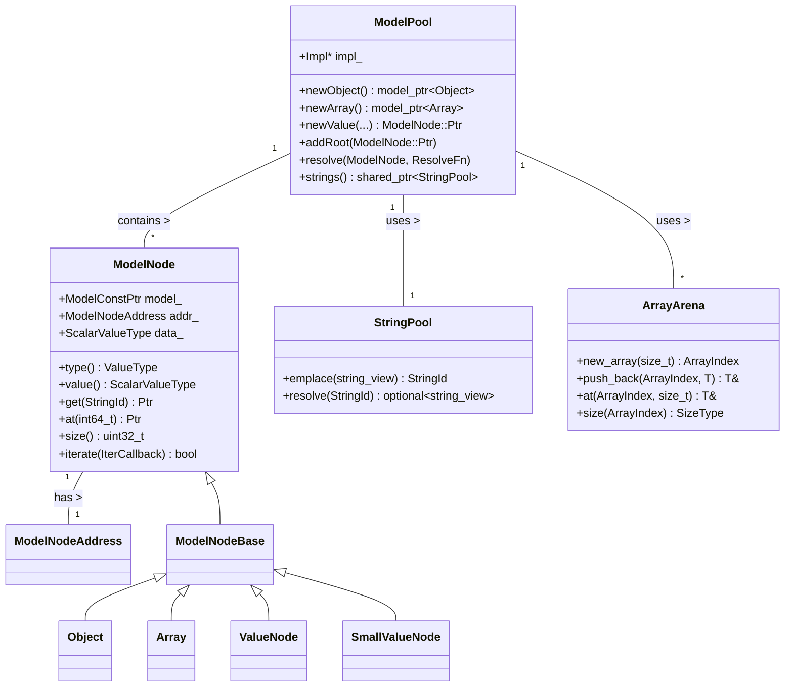
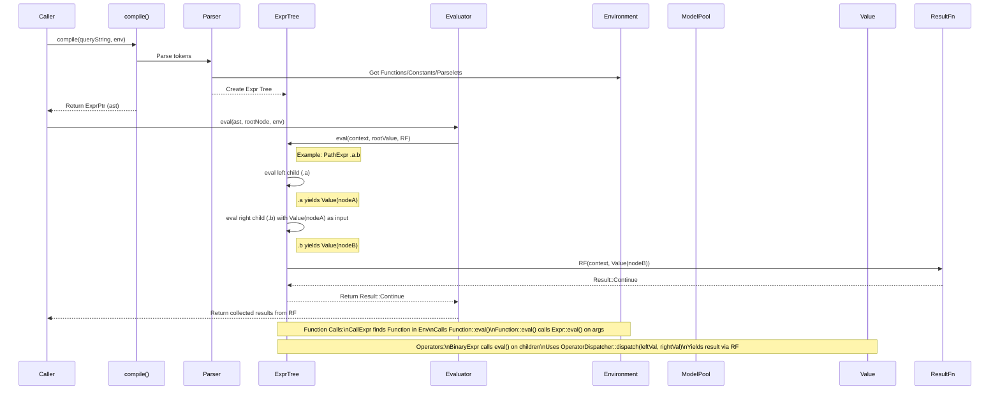

# Simfil Developer Guide

## 1. Overview

### Purpose and Scope

Simfil is a C++ library designed for efficiently querying and manipulating hierarchical data structures, similar in nature to JSON. It provides a concise query language to filter, transform, and extract information from data models. Key features include:

*   **Efficient Data Representation:** Uses a columnar, arena-based storage (`ModelPool`) for memory efficiency, especially with large datasets containing repetitive structures or values.
*   **Expressive Query Language:** Offers a path-based syntax with functions, operators, and sub-expressions for complex data navigation and manipulation. (See `simfil-language.md` for details).
*   **Extensibility:** Allows defining custom functions and data types (`MetaType`) to integrate domain-specific logic.
*   **Performance:** Aims for high performance through optimized data storage and evaluation strategies.

The library is suitable for scenarios where querying structured data (like configuration files, API responses, or specialized data formats) is required within a C++ application, prioritizing memory usage and query speed.

### High-Level Architecture

Simfil processes queries in several stages:

1.  **Parsing:** The input query string is tokenized (`tokenize`) and parsed into an Abstract Syntax Tree (AST) using a Pratt parser (`Parser`).
2.  **Compilation (Optional Simplification):** The AST might undergo minor simplifications where constant expressions are pre-evaluated.
3.  **Evaluation:** The AST (`Expr` tree) is evaluated against a data model (`ModelNode` within a `ModelPool`) using an `Environment` that provides context (functions, constants, string interning).
4.  **Results:** The evaluation yields a sequence of `Value` objects representing the query results.

```mermaid
flowchart LR
    A[Query String] --> B(Tokenizer);
    B --> C(Parser);
    C --> D{AST};
    D --> E(Evaluator);
    F[Data Model\n(ModelPool)] --> E;
    G[Environment] --> E;
    E --> H[Results\n(Value Sequence)];

    subgraph Parsing
        B; C; D;
    end

    subgraph Evaluation
        E; F; G; H;
    end
```

## 2. Setup and Prerequisites

### Dependencies

*   **CMake:** Version 3.19 or higher (required by `CMakeLists.txt`).
*   **Conan:** Version >=1.62.0 (required by `conanfile.py`).
*   **C++ Compiler:** A compiler supporting C++20 standard (required by `CMakeLists.txt` and validated in `conanfile.py`).
*   **Core Dependencies (Managed by Conan):**
    *   `sfl/[~1]`: Segmented containers library (used in `ArrayArena`).
    *   `fmt/[~10]`: For string formatting.
    *   `bitsery/[~5]`: For serialization/deserialization.
    *   `nlohmann_json/[~3]` (Optional, if `with_json` option is True): For JSON parsing and serialization.
*   **Test/Dev Dependencies (Not included in library install):**
    *   `catch2` (Likely used, based on common C++ practices, though not explicitly in `conanfile.py` requirements).
    *   `readline` (Optional, if `SIMFIL_WITH_REPL` CMake option is enabled and platform supports it).

### Environment Setup

1.  **Install Prerequisites:** Ensure CMake (>=3.19), Conan (>=1.62.0), and a suitable C++20 compiler are installed and accessible in your PATH.
2.  **Clone Repository:** Clone the simfil repository and initialize its submodules:
    ```bash
    git clone <repository-url>
    cd simfil
    git submodule update --init --recursive
    ```
3.  **Install Dependencies:** Use Conan to fetch and install dependencies. A typical workflow involves creating a build directory:
    ```bash
    mkdir build
    cd build
    # Example: Install for Release build
    conan install .. --build=missing -s build_type=Release
    # Example: Install for Debug build
    # conan install .. --build=missing -s build_type=Debug
    ```
    *   Adjust `-s build_type` as needed.
    *   Conan profiles might be necessary depending on your specific compiler and OS setup.

### Configuration & Building

1.  **Configure with CMake:** From the `build` directory created above:
    ```bash
    # Example: Configure for Release build
    cmake .. -DCMAKE_TOOLCHAIN_FILE=build/generators/conan_toolchain.cmake -DCMAKE_BUILD_TYPE=Release

    # Example: Configure for Debug build
    # cmake .. -DCMAKE_TOOLCHAIN_FILE=build/generators/conan_toolchain.cmake -DCMAKE_BUILD_TYPE=Debug
    ```
    *   Ensure `CMAKE_BUILD_TYPE` matches the `build_type` used during `conan install`.
    *   The `conan_toolchain.cmake` file (generated by `conan install`) integrates Conan dependencies with CMake.
    *   You can customize the build with CMake options defined in `CMakeLists.txt`:
        *   `-DSIMFIL_SHARED=ON/OFF` (Default: ON): Build shared or static library.
        *   `-DSIMFIL_FPIC=ON/OFF` (Default: ON): Enable Position Independent Code (relevant for static builds linked into shared libs).
        *   `-DSIMFIL_WITH_MODEL_JSON=ON/OFF` (Default: ON): Include nlohmann_json support.
        *   `-DSIMFIL_WITH_REPL=ON/OFF` (Default: ON if main project): Build the `simfil-repl` executable.
        *   `-DSIMFIL_WITH_EXAMPLES=ON/OFF` (Default: ON if main project): Build examples (like `minimal`).
        *   `-DSIMFIL_WITH_TESTS=ON/OFF` (Default: ON if main project): Build tests (`test.simfil` executable).
        *   `-DSIMFIL_WITH_COVERAGE=ON/OFF` (Default: OFF unless GCC/Debug): Enable code coverage instrumentation (requires gcovr).
2.  **Build:**
    ```bash
    cmake --build .
    ```
    This will compile the library (`libsimfil.so` or `simfil.dll` or `libsimfil.a`) and any enabled executables (tests, repl, examples), typically placed in a `bin` or `lib` subdirectory within `build`.

## 3. Core Concepts and Components

### 3.1. Data Model (`simfil::model`)

The core of data representation in simfil.

*   **`ModelPool`:** The main container for the data (`include/simfil/model/model.h`). It uses specialized, columnar storage for different data types (integers, floats, strings, objects, arrays) to optimize memory usage. It manages the lifetime of all nodes. It relies heavily on `ArrayArena` and `StringPool`.
*   **`ModelNode`:** A view or handle to a node within the `ModelPool` (`include/simfil/model/nodes.h`). It doesn't own the data itself but provides an interface to access it (type, value, children). It holds a `ModelNodeAddress` and a `shared_ptr` to its `Model` (usually the `ModelPool`).
*   **`ModelNodeAddress`:** A compact 32-bit identifier for a node (`include/simfil/model/nodes.h`), encoding its column (type) and index within that column. Small scalar values (small integers, booleans) can be stored directly within the address, avoiding separate storage allocation.
*   **`ArrayArena`:** A specialized allocator (`include/simfil/model/arena.h`) built on `sfl::segmented_vector`. It efficiently manages append-only collections of data (like object fields or array elements). When an array grows, it allocates larger chunks, linking them together, minimizing reallocations and fragmentation. This is fundamental to `ModelPool`'s efficiency.
*   **`StringPool`:** Interns strings (primarily object keys) to save memory (`include/simfil/model/string-pool.h`). Maps strings to `StringId`s (uint16_t) and ensures that identical strings are stored only once. Case-insensitive by default. `ModelPool` uses a `StringPool` to manage field names.



### 3.2. Values (`simfil::Value`)

Represents data during query evaluation (`include/simfil/value.h`). It can hold:

*   Primitive types: `null`, `bool`, `int64_t`, `double`, `std::string`, `std::string_view`.
*   Model nodes: `ModelNode::Ptr` (references into a `ModelPool`).
*   Transient objects: `TransientObject` (custom types created during evaluation, see Advanced Topics).
*   Special `Undef` type (represented by `UndefinedType` struct, distinct from `null`).

It uses a `std::variant` internally to store the actual data. `Value` objects are typically returned by expression evaluation via the `ResultFn` callback.

### 3.3. Tokenizer (`simfil::tokenize`)

Located in `src/token.cpp`, the `tokenize` function takes a query string (`std::string_view`) and breaks it down into a `std::vector<Token>` (`include/simfil/token.h`). It recognizes keywords (`and`, `or`, `not`), operators (`+`, `-`, `*`, `/`, `.`, `**`, `==`, etc.), literals (numbers, strings, regexps like `re'...'`), and punctuation (`(`, `)`, `[`, `]`, `{`, `}`).

### 3.4. Parser (`simfil::Parser`)

Simfil uses a Pratt parser (`src/parser.cpp`, `include/simfil/parser.h`). This type of parser elegantly handles operator precedence and associativity by associating parsing logic (parselets) with tokens.

*   **`PrefixParselet`:** Handles tokens that start an expression (e.g., literals, unary operators like `-`, `not`, function names, `(`, `[`).
*   **`InfixParselet`:** Handles tokens that appear between operands (e.g., binary operators like `+`, `==`, path operator `.`, subscript `[`, sub-expression `{`). Each infix parselet has a `precedence()`.
*   The parser consumes tokens and uses registered parselets (stored in `prefixParsers` and `infixParsers` maps within the `Parser` instance) to build an Abstract Syntax Tree (AST). It manages precedence by calling `parsePrecedence`.

### 3.5. Expressions (`simfil::Expr`)

The AST is composed of nodes inheriting from `simfil::Expr` (`include/simfil/expression.h`). Each `Expr` node represents a part of the query and has an `eval` method. Key implementations (found in `src/simfil.cpp`):

*   `ConstExpr`: Represents a literal value.
*   `FieldExpr`: Represents accessing a field by name (e.g., `.foo`, `_`).
*   `WildcardExpr`: Represents `**`.
*   `AnyChildExpr`: Represents `*`.
*   `PathExpr`: Represents chained field access (e.g., `.foo.bar`).
*   `SubscriptExpr`: Represents array/object access by index/key (e.g., `[0]`, `['key']`).
*   `SubExpr`: Represents sub-queries (`{...}`).
*   `CallExpression`: Represents a function call (e.g., `count(...)`).
*   `BinaryExpr`, `UnaryExpr`: Represent standard operations.
*   `UnpackExpr`: Represents the unpack operator (`...`).

### 3.6. Environment (`simfil::Environment`)

Holds the context required for parsing and evaluation (`include/simfil/environment.h`). It contains:

*   Registered functions (`std::map<std::string, const Function*, CaseInsensitiveCompare> functions`).
*   Registered constants (`std::map<std::string, Value, CaseInsensitiveCompare> constants`).
*   A shared pointer to the `StringPool` used for field name interning. This *must* be the same `StringPool` used by the `ModelPool` being queried.
*   Mechanisms for collecting runtime warnings (`warnings`) and trace information (`traces`).

A `Context` object (`include/simfil/result.h`) is passed during evaluation, containing a pointer to the `Environment` and the current evaluation phase (`Compilation` or `Evaluation`).

### 3.7. Functions (`simfil::Function`)

Built-in and custom functions inherit from the `simfil::Function` interface (`include/simfil/function.h`). They define:
*   `ident()`: Returns `FnInfo` (name, description, signature) for metadata.
*   `eval()`: Executes the function's logic. It takes the current `Context`, the input `Value`, a vector of unevaluated argument expressions (`std::vector<ExprPtr>`), and a `ResultFn` callback to yield results.

Functions are registered in the `Environment::functions` map. Implementations for built-ins are in `src/function.cpp`.

### 3.8. Operators (`simfil::Operator*`)

Operators (`+`, `-`, `==`, `!=`, `<`, `>`, etc.) are implemented using template dispatch (`include/simfil/operator.h`).
*   Template structs (e.g., `OperatorAdd`, `OperatorEq`, `OperatorNegate`) define `operator()` overloads for valid combinations of primitive C++ types corresponding to `Value` types.
*   `UnaryOperatorDispatcher` and `BinaryOperatorDispatcher` are template classes that take an operator struct (e.g., `OperatorAdd`) as a template parameter. Their `dispatch` static methods take `Value` objects as input.
*   Inside `dispatch`, `std::visit` is used on the `Value`'s internal `std::variant` to determine the runtime types of the operands.
*   The appropriate `operator()` overload from the operator struct (e.g., `OperatorAdd::operator()(int64_t, double)`) is called.
*   If no suitable overload exists, `InvalidOperands` is returned, which is caught and translated into an `InvalidOperandsError` or a runtime error message.
*   This approach keeps the operator logic separate from the `Expr` evaluation code and handles type checking systematically.

### 3.9. Evaluation Flow

The `simfil::eval` function (or calling `Expr::eval` directly) initiates the process.

1.  Evaluation starts at the root of the AST (`ExprPtr`).
2.  Each `Expr` node's `eval` method is called recursively.
3.  `eval` takes the current `Context`, the current input `Value` (representing the data node being processed), and a `ResultFn` callback.
4.  **Data Flow:** Nodes like `PathExpr` or `SubscriptExpr` typically evaluate their "left" part first. Each `Value` yielded by the left side is then used as the input `Value` for evaluating the "right" part.
5.  **Operator Evaluation:** Operator expressions (e.g., `BinaryExpr<OperatorAdd>`) evaluate their operands (left and right children) recursively. They collect the resulting `Value`s and then use the appropriate `OperatorDispatcher` (e.g., `BinaryOperatorDispatcher<OperatorAdd>::dispatch(leftValue, rightValue)`) to compute the result.
6.  **Function Evaluation:** `CallExpression` finds the `Function*` in the `Environment` and calls its `eval` method, passing the unevaluated argument `ExprPtr`s. The function implementation controls how and when arguments are evaluated using `arg->eval(...)`.
7.  **Result Yielding:** All evaluation paths ultimately yield results by calling the `ResultFn` callback passed down the chain. A single `Expr::eval` call might invoke the callback multiple times if the expression naturally produces multiple results (e.g., pathing through an array).
8.  **Control Flow:** The `ResultFn` callback returns `Result::Continue` or `Result::Stop`, allowing consumers (like the `any` or `each` functions, or the final result collector) to terminate evaluation early.



## 4. Advanced Topics

### 4.1. Model Representation & Arena Allocation

Simfil's `ModelPool` is designed for memory efficiency, particularly when dealing with potentially large, JSON-like structures that might have significant repetition.

**Columnar Storage:** Instead of storing each object or array as a contiguous block, `ModelPool` uses separate, type-specific containers (columns) for different primitive types (`int64_t`, `double`, `string`) and for the structures of objects and arrays. This improves data locality for type-specific operations.

**`ModelNodeAddress`:** This 32-bit struct is key to the storage strategy (`include/simfil/model/nodes.h`).
```c++
struct ModelNodeAddress
{
    uint32_t value_ = 0;

    // Lower 8 bits: Column ID (type enum like Objects, Arrays, Int64, UInt16, etc.)
    [[nodiscard]] uint8_t column() const;
    // Upper 24 bits: Index within the column OR the value itself for small types
    [[nodiscard]] uint32_t index() const;

    // Special accessors for small value optimization
    [[nodiscard]] uint16_t uint16() const; // Used for UInt16 column type and Bool
    [[nodiscard]] int16_t int16() const;  // Used for Int16 column type
};
```
*   **Small Value Optimization:** For `Bool`, `Int16`, and `UInt16`, the actual value is stored directly in the upper bits (`index()` part) of the address, eliminating the need for separate storage in a column vector. The `column()` ID identifies the type. `Null` type also uses a specific column ID with index 0.
*   **Column Index:** For other types (Objects, Arrays, Int64, Double, String), the `index()` points into the corresponding column vector managed within `ModelPool::Impl` (e.g., `impl_->columns_.i64_`, `impl_->columns_.objectMemberArrays_`).

**`ArrayArena` (`include/simfil/model/arena.h`):**
This class provides the backbone for storing the variable-sized lists needed for object fields (`Object::Field` structs containing `StringId` and `ModelNodeAddress`) and array elements (`ModelNodeAddress`).
```c++
// Simplified structure
template <class ElementType_, size_t PageSize = 4096, ...>
class ArrayArena {
    struct Chunk {
        SizeType_ offset;    // Start offset in data_ vector for this chunk's elements
        SizeType_ capacity;  // Max elements this chunk can hold
        SizeType_ size;      // Current elements in this chunk (or total elements if head chunk)
        ArrayIndex next;    // Index of next chunk in continuations_ (-1 if none)
        ArrayIndex last;    // Index of the *last* chunk in the sequence (only stored in head chunk)
    };

    // Head chunks (one per logical array, stores metadata like total size and last chunk index)
    sfl::segmented_vector<Chunk, ...> heads_;
    // Continuation chunks (allocated when an array outgrows its previous chunk)
    sfl::segmented_vector<Chunk, ...> continuations_;
    // Actual element data stored contiguously within segments
    sfl::segmented_vector<ElementType_, PageSize> data_;

    #ifdef ARRAY_ARENA_THREAD_SAFE
    mutable std::shared_mutex lock_; // Optional locking
    #endif

    // Ensures capacity for one more element, potentially allocating a new chunk
    Chunk& ensure_capacity_and_get_last_chunk(ArrayIndex a);
    // ... at(), push_back(), emplace_back(), iterate(), size(), iterators ...
};
```
*   **Segmented Vectors:** It uses `sfl::segmented_vector` for `heads_`, `continuations_`, and `data_`. This container allocates memory in fixed-size pages (segments), avoiding large contiguous allocations and reducing reallocation overhead compared to `std::vector` when growing significantly.
*   **Chunk Linking:** Each logical array managed by the arena starts with a `Chunk` in `heads_`. When an array (`ArrayIndex`) needs to grow beyond its current chunk's capacity, `ensure_capacity_and_get_last_chunk` allocates a *new*, larger chunk (typically double the size) from `continuations_`. It links the previous chunk to the new one via the `next` index and updates the `last` index in the corresponding `heads_` chunk to point to the new chunk.
*   **Append Operation:** `push_back` or `emplace_back` first gets the *last* chunk using the `last` index stored in the head chunk (O(1) access). If there's space in that chunk, the element is added directly to the `data_` vector at the correct offset (`last_chunk.offset + last_chunk.size`). If not, `ensure_capacity_and_get_last_chunk` handles allocating/linking a new chunk before the element is added. The `size` in the head chunk (total elements) and the last chunk are incremented.
*   **Element Access (`at`):** Accessing an element at a specific index `i` requires traversing the linked list of chunks starting from the head, subtracting each chunk's capacity from `i` until the correct chunk is found, and then accessing `data_[chunk.offset + remaining_i]`.
*   **Iteration:** Iterating an array involves traversing the linked list of chunks (`heads_` -> `continuations_[next]` -> ...) and accessing the elements within each chunk in `data_`. The `iterate` method provides an efficient callback-based mechanism.
*   **Thread Safety (Optional):** If `ARRAY_ARENA_THREAD_SAFE` is defined, a `std::shared_mutex` protects against race conditions. Chunk allocation (`ensure_capacity_and_get_last_chunk`) requires an exclusive lock (`std::unique_lock`). Reads (`at`, iteration) and appends that *don't* require new chunk allocation typically use shared locks (`std::shared_lock`), allowing concurrent reads and simple appends.

This design makes appending elements very fast (often lock-free or only requiring shared locks if thread-safe) and memory-efficient for the dynamic lists used by objects and arrays within the `ModelPool`.

### 4.2. Extensibility: Functions and MetaTypes

Simfil allows extending its capabilities in two main ways:

**1. Custom Functions:**

*   **Interface:** Inherit from `simfil::Function` (`include/simfil/function.h`).
    ```c++
    class Function {
    public:
        virtual ~Function() = default;
        // Metadata for documentation/introspection
        virtual auto ident() const -> const FnInfo& = 0;
        // Evaluation logic
        virtual auto eval(Context ctx, Value inputVal,
                          const std::vector<ExprPtr>& args, // Arguments as unevaluated expressions
                          const ResultFn& resultCallback) const -> Result = 0;
    };
    ```
*   **Implementation:** Implement `ident()` to provide function name, description, and signature. Implement `eval()` to perform the function's logic. Arguments (`args`) are provided as unevaluated `ExprPtr`s, allowing functions to control *how* and *if* arguments are evaluated (e.g., for short-circuiting or special handling like in `sum`). Use `Expr::eval()` to evaluate arguments as needed, passing down the `Context` and providing a lambda `ResultFn` to collect the argument's results. Yield the function's final results by calling the main `resultCallback`.
*   **Registration:** Add a static instance (or other managed instance) of your function implementation to the `Environment::functions` map, keyed by the function name.
    ```c++
    // In your setup code:
    MyCustomFn MyCustomFn::Fn; // Static instance recommended for built-ins
    myEnvironment.functions["myCustomFunc"] = &MyCustomFn::Fn;
    ```
*   **Argument Handling:** Use helpers like `ArgParser` (internal to `function.cpp`) or `simfil::util::evalArg1Any`/`evalArg1` (`function.h`) to simplify evaluating arguments and handling type/count errors.

**2. Custom Data Types (`MetaType`):**

Simfil allows creating temporary, custom data types during evaluation using `TransientObject` and `MetaType`. These are useful for representing intermediate results or concepts not native to the core data model (like the built-in `IRange` or `Re` types for ranges and regular expressions).

*   **`MetaType` Interface (`include/simfil/transient.h`):** Defines the behavior of a custom type.
    ```c++
    struct MetaType {
        const std::string ident; // Type name (e.g., "irange", "re")

        // Memory management for the custom data payload
        virtual auto init() const -> void* = 0; // Allocate data
        virtual auto copy(void*) const -> void* = 0; // Deep copy data
        virtual auto deinit(void*) const -> void = 0; // Free data

        // Operator behavior: Implement how this type interacts with operators
        virtual auto unaryOp(std::string_view opName, const TransientObject&) const -> Value = 0;
        virtual auto binaryOp(std::string_view opName, const TransientObject& self, const Value& other) const -> Value = 0;
        virtual auto binaryOp(std::string_view opName, const Value& other, const TransientObject& self) const -> Value = 0;

        // Unpacking behavior (for the ... operator)
        virtual auto unpack(const TransientObject& self, std::function<bool(Value)> yieldResult) const -> void = 0;
    };
    ```
*   **`TransientObject`:** A wrapper holding a pointer to the `MetaType` singleton and a `void*` to the custom data payload managed by `init`/`copy`/`deinit`. `Value` can store a `TransientObject`.
*   **`TypedMetaType` Helper (`include/simfil/typed-meta-type.h`):** A CRTP (Curiously Recurring Template Pattern) base class to simplify implementing `MetaType` for a specific C++ struct/class (`Type`). It handles memory management (`new`/`delete`) and casts `void*` data automatically to `Type*` or `const Type*`. You only need to implement the operator and unpack logic using the strongly-typed `Type&` or `const Type&`.
    ```c++
    // Example: Structure of IRangeType using TypedMetaType
    struct IRange { /* ... data ... */ };

    class IRangeType : public TypedMetaType<IRange> {
    public:
        static IRangeType Type; // Singleton instance
        IRangeType() : TypedMetaType("irange") {} // Pass identifier to base

        // Factory method to create a Value containing the TransientObject
        auto make(int64_t a, int64_t b) -> Value;

        // Implement operator logic using the typed data (const IRange& self)
        auto unaryOp(std::string_view opName, const IRange& self) const -> Value override;
        auto binaryOp(std::string_view opName, const IRange& self, const Value& other) const -> Value override;
        auto binaryOp(std::string_view opName, const Value& other, const IRange& self) const -> Value override;
        auto unpack(const IRange& self, std::function<bool(Value)> yieldResult) const -> void override;
    };
    IRangeType IRangeType::Type; // Define the singleton instance
    ```
*   **Usage:** Functions (like `range()` or `re()`) create `Value` objects containing `TransientObject`s by calling the `MetaType`'s factory method (`make`). When these `Value`s are used in operations (e.g., `range(1, 5) == 3`, `myString == re(...)`, `range(1, 3)...`), the `OperatorDispatcher` detects the `TransientObject`, retrieves its `MetaType*`, and calls the corresponding `unaryOp`, `binaryOp`, or `unpack` method on the `MetaType` instance, passing the `TransientObject` itself.

This mechanism allows seamless integration of custom types with custom behavior (including operator overloading and unpacking) into the simfil query language evaluation process without modifying the core parser or expression types.

## 5. Development Workflow

### Building

As described in [Setup and Prerequisites](#setup-and-prerequisites), the standard workflow uses Conan and CMake:

1.  `mkdir build && cd build`
2.  `conan install .. [--profile ...] [-s build_type=...]`
3.  `cmake .. -DCMAKE_TOOLCHAIN_FILE=build/generators/conan_toolchain.cmake [-DCMAKE_BUILD_TYPE=...] [-DOPTION=VALUE ...]` (See Setup section for options)
4.  `cmake --build . [--target <target_name>]`

Common targets include the library itself (`simfil`), tests (`test.simfil`), the REPL (`repl`), and examples (`minimal`).

### Running Tests

Simfil uses Catch2 for unit testing (assumed, common practice). Tests are located in the `test/` directory and built into the `test.simfil` executable (based on `CMakeLists.txt` coverage setup).

*   Ensure tests are enabled during CMake configuration (`-DSIMFIL_WITH_TESTS=ON`).
*   Build the `test.simfil` target (or build all).
*   Run tests using CTest from the `build` directory:
    ```bash
    ctest # Runs tests for the configured build type
    # Or specify configuration explicitly:
    # ctest -C Debug
    # ctest -C Release
    ```
*   For more detailed output or to run specific tests, execute the test binary directly (path might vary slightly based on CMake/platform):
    ```bash
    # From the build directory
    ./bin/test.simfil [Catch2 arguments, e.g., -s to list tests, or specific test names]
    ```

### Code Coverage (Optional)

If the project is configured with `-DSIMFIL_WITH_COVERAGE=ON` (typically requires GCC/Clang and `gcovr` to be installed), you can generate an HTML code coverage report after running the tests.

1.  Ensure tests have been run at least once via `ctest` or by running `test.simfil`.
2.  Build the `coverage` target from the `build` directory:
    ```bash
    cmake --build . --target coverage
    ```
3.  This will typically generate the report in a `coverage/` subdirectory within your `build` directory. Open the `index.html` file in a web browser.

### Debugging

*   Configure CMake with `Debug` build type: `cmake .. -DCMAKE_TOOLCHAIN_FILE=build/generators/conan_toolchain.cmake -DCMAKE_BUILD_TYPE=Debug ...`
*   Build the debug version: `cmake --build .`
*   Use standard C++ debuggers like GDB or LLDB to attach to or run the desired executable (e.g., `test.simfil`, `repl` if built).
    ```bash
    gdb ./bin/test.simfil
    (gdb) run
    ```
*   Set breakpoints, inspect variables, and step through the code as usual.

### Contributing

1.  **Fork & Clone:** Fork the repository on its hosting platform (e.g., GitHub) and clone your fork locally. Remember to initialize submodules (`git submodule update --init --recursive`).
2.  **Branch:** Create a new feature or bugfix branch from an up-to-date `main` or `develop` branch: `git checkout -b my-feature-branch`.
3.  **Code:** Implement your changes. Adhere to the existing coding style and conventions (see below).
4.  **Test:** Add new unit tests for your changes in the `test/` directory to cover new functionality or bug fixes. Ensure all tests pass (`ctest`).
5.  **Commit:** Commit your changes with clear and concise messages. Follow conventional commit message formats if applicable to the project.
6.  **Push:** Push your branch to your fork: `git push origin my-feature-branch`.
7.  **Pull Request (PR):** Create a Pull Request from your branch on your fork to the main repository's `main` (or appropriate target) branch. Describe your changes clearly in the PR, referencing any related issues.

### Best Practices & Coding Conventions

*   **C++ Standard:** Adhere to C++20, as required by `CMakeLists.txt`.
*   **Style:** Follow the existing coding style. The `.editorconfig` file provides basic settings (UTF-8, LF line endings, final newline, 4-space indents for C++/headers, 2-space for CMake). Generally observe:
    *   Naming: `snake_case` for variables and functions, `PascalCase` for classes/structs/enums, `ALL_CAPS` for compile-time constants/macros.
    *   Pointers/Null: Use `nullptr`.
    *   Includes: Use `#pragma once` for header guards. Organize includes (standard, external, project).
    *   Const Correctness: Use `const` where applicable.
    *   Modern C++: Prefer smart pointers (`std::unique_ptr`, `std::shared_ptr`) over raw pointers for ownership. Use range-based for loops, structured bindings, etc., where appropriate.
*   **Clarity & Simplicity:** Write code that is easy to understand and maintain. Add comments for non-obvious logic. Keep functions focused.
*   **Testing:** Ensure adequate test coverage for all code contributions.
*   **Dependencies:** Manage external dependencies exclusively via `conanfile.py`.
*   **Documentation:** Update relevant documentation (README, developer guide, code comments, language spec) if your changes affect usage, architecture, or the language itself.

## 6. Reference

### Documentation

*   **README.md:** Provides a general overview, build instructions, and basic usage examples. (Located in the repository root).
*   **simfil-language.md:** Detailed specification of the Simfil query language syntax, operators, functions, and semantics. (Included in the chat).
*   **LICENSE:** Contains the license information for the library. (Located in the repository root).
*   **Code Comments:** Refer to comments within the header (`include/`) and source (`src/`) files for implementation-specific details.

### Key APIs / Classes

*   `simfil::ModelPool`: Primary interface for creating and managing data models.
*   `simfil::ModelNode`: Interface for interacting with nodes in the model.
*   `simfil::Value`: Represents data during evaluation.
*   `simfil::compile`: Compiles a query string into an `ExprPtr`.
*   `simfil::eval`: Evaluates a compiled expression against a model node.
*   `simfil::Environment`: Manages evaluation context (functions, constants, string pool).
*   `simfil::Function`: Base class for implementing custom functions.
*   `simfil::MetaType`: Base class for implementing custom transient data types.
*   `simfil::ArrayArena`: Efficient allocator for object/array members.
*   `simfil::StringPool`: Manages string interning.
*   `simfil::json::parse`: (If JSON support enabled) Parses JSON into a `ModelPool`.

### Glossary

*   **Arena Allocator:** A memory allocation strategy that allocates large blocks (arenas) and dispenses smaller chunks from them, often improving performance and locality. `ArrayArena` is simfil's implementation for object/array members.
*   **AST (Abstract Syntax Tree):** A tree representation of the syntactic structure of a simfil query.
*   **Columnar Storage:** Storing data for each attribute (column) contiguously. `ModelPool` uses this for primitive types.
*   **Environment:** The context holding functions, constants, string pool, etc., needed for query parsing and evaluation.
*   **Expression (Expr):** A node in the AST representing a part of the query that evaluates to a `Value` (or sequence of `Value`s).
*   **Interning:** Storing only one copy of each unique immutable value (like strings). See `StringPool`.
*   **MetaType:** An interface defining the behavior (operators, memory management) of a custom `TransientObject` type.
*   **Model:** The data structure (managed by `ModelPool`) against which queries are run.
*   **ModelNode:** A handle/view representing a single element (object, array, scalar) within the `ModelPool`.
*   **ModelNodeAddress:** A compact identifier encoding a node's type (column) and index within the `ModelPool`.
*   **ModelPool:** The primary class for creating and managing simfil data models using efficient storage.
*   **Parselet:** A piece of parser logic associated with a token in a Pratt parser (PrefixParselet, InfixParselet).
*   **Pratt Parser:** An efficient parsing technique using token precedences and parselets.
*   **ResultFn:** A callback function used during evaluation to yield resulting `Value`s.
*   **String ID (`StringId`):** A numeric identifier (uint16_t) representing an interned string in the `StringPool`.
*   **StringPool:** Manages string interning.
*   **Token:** The smallest meaningful unit of a query string (keyword, operator, literal).
*   **TransientObject:** A temporary, custom object created during evaluation, managed by a `MetaType`.
*   **Value:** The universal representation of data during query evaluation.
