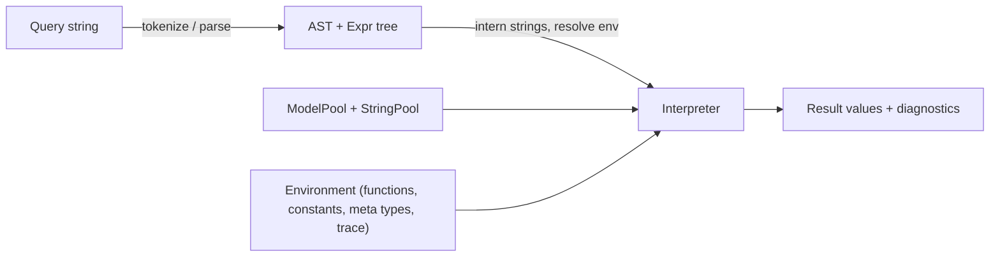
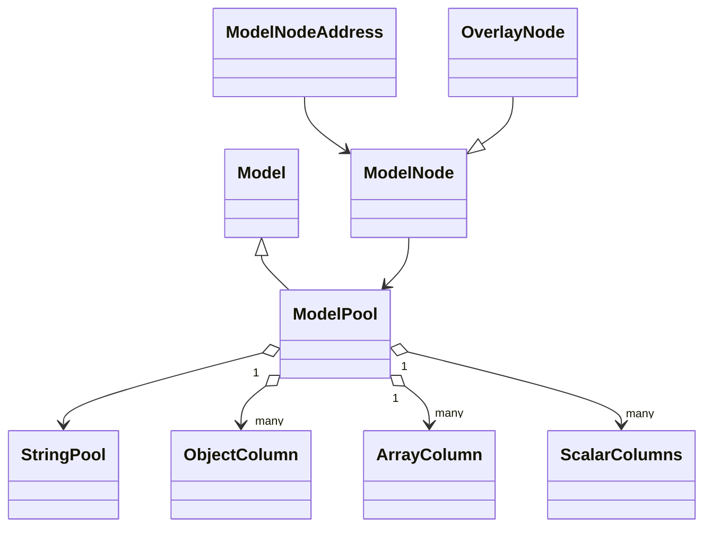
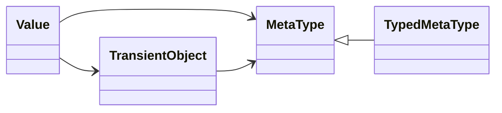
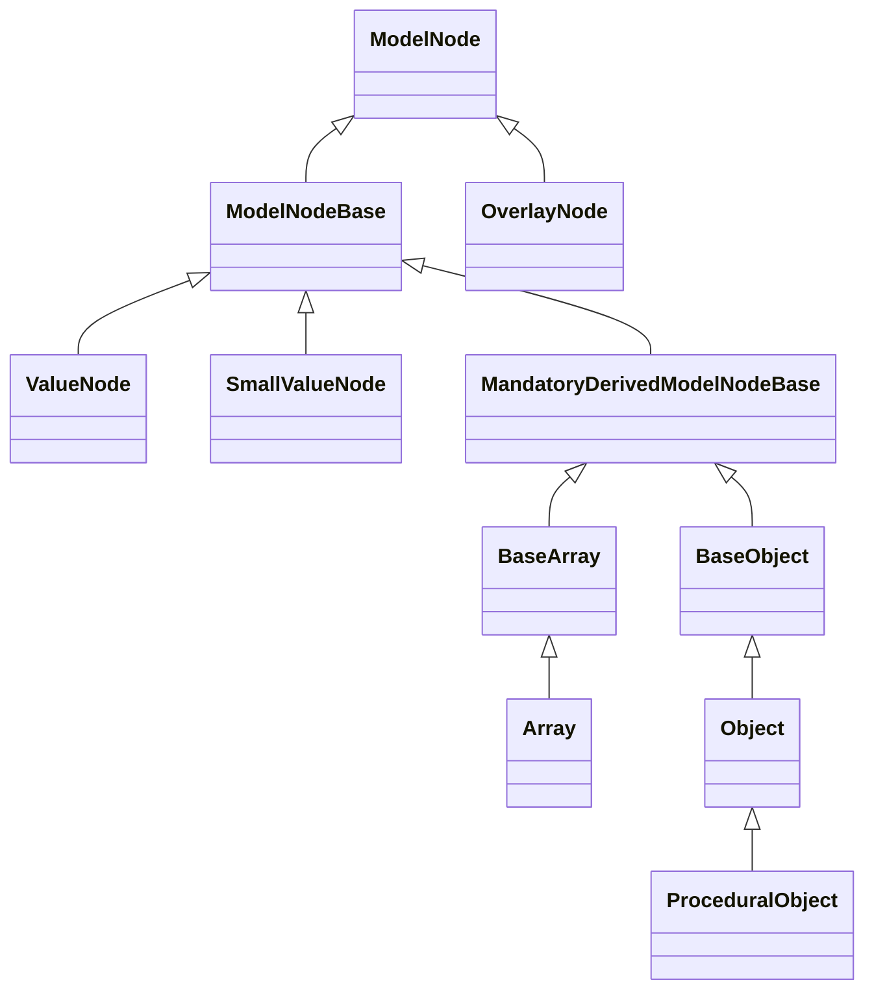
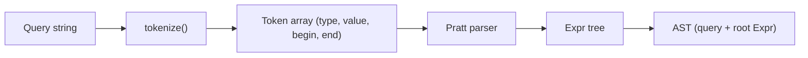
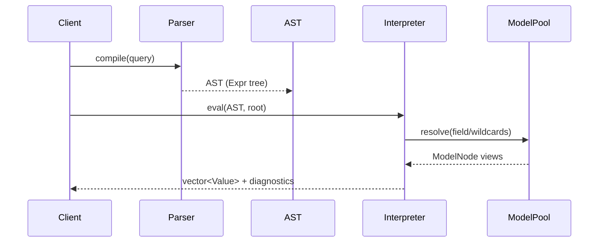
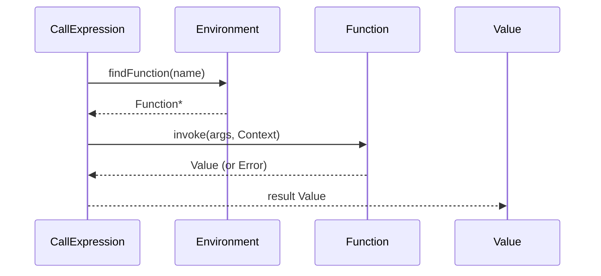
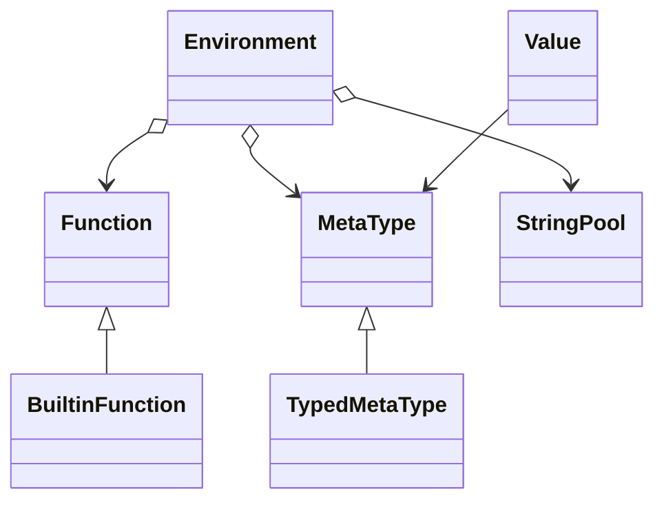
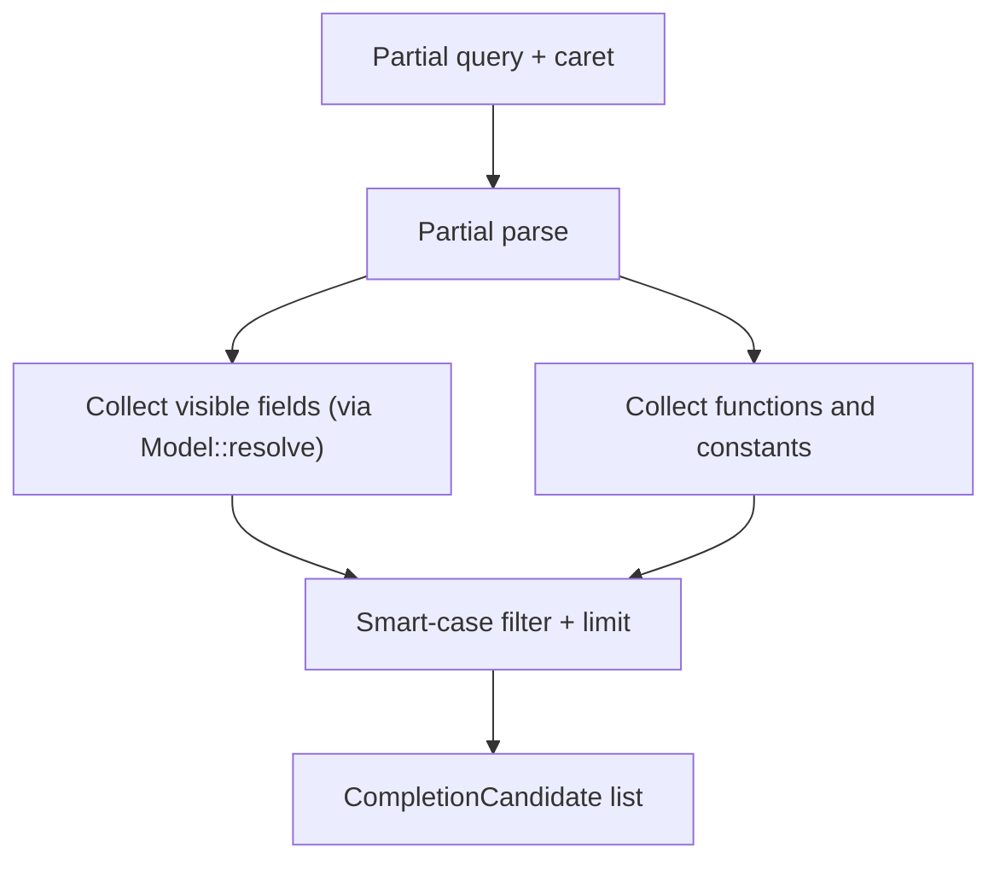
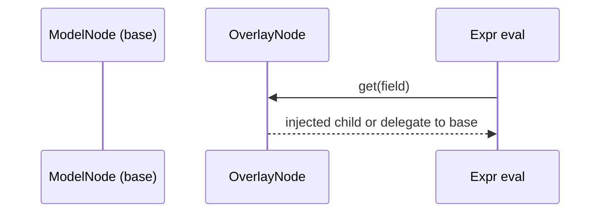

# Simfil Developer Guide

This guide describes simfil’s internal architecture: data storage, parsing and evaluation, node interfaces, and extensibility points. It is written for engineers embedding simfil or extending the interpreter and data model. Source code and issue tracking are available at [github.com/Klebert-Engineering/simfil](https://github.com/Klebert-Engineering/simfil).

## Big picture



- Queries are parsed into an expression tree (`Expr` subclasses).
- An `Environment` holds registered functions, constants, meta types, string pools, and debug/trace hooks.
- `ModelPool` stores data in columnar arenas with interned field names (`StringPool`).
- The interpreter walks the expression tree against `ModelNode` views, producing `Value` objects and diagnostics.

## Core building blocks at a glance

| Concept | Where | Purpose | Key types |
|---------|-------|---------|-----------|
| Model storage | `model/model.h`, `model/nodes.h` | Columnar pool for objects, arrays, scalars; backs every query. | `ModelPool`, `ModelNode`, `ModelNodeAddress`, `StringPool` |
| Runtime values | `value.h`, `types.h` | Immutable runtime data passed between expressions and functions. | `Value`, `ValueType`, `TransientObject`, `MetaType` |
| Expressions | `expression.h`, `expressions.*` | AST node classes with `ieval` implementations. | `Expr` subclasses (field, path, call, wildcard, logical, etc.) |
| Environment | `environment.h` | Registry for functions/constants/meta types; tracing, warnings, timeouts. | `Environment`, `Context`, `Trace`, `Debug` |
| Parser | `parser.cpp`, `expression-patterns.h`, `token.cpp` | Pratt parser building `Expr` trees from tokens. | `Token`, `AST` |
| Completion | `completion.cpp` | Partial parser that offers path/function suggestions. | `CompletionOptions`, `CompletionCandidate` |
| Diagnostics | `diagnostics.*`, `error.*` | Parser/runtime errors with source spans. | `Diagnostics`, `Error`, `SourceLocation` |
| Extensibility | `function.*`, `typed-meta-type.h`, `overlay.*` | Register new functions/meta types or overlay nodes. | `Function`, `TypedMetaType`, `OverlayNode` |

## Storage model (ModelPool, nodes, strings)

At runtime, all model data resides in a `ModelPool`. A pool owns one column per node category (objects, arrays, full-width scalars, pooled strings, and, in derived pools, custom columns). Every node is identified by a compact `ModelNodeAddress` consisting of an 8‑bit column identifier and a 24‑bit index into that column. For “small” scalar types such as `bool`, `int16_t`, and `uint16_t`, the value is encoded directly into the index bits, so no separate storage is needed.

`ModelNode` is a semantic view onto a particular address within a `ModelPool`. The `model_ptr<T>` wrapper ensures that these views keep the underlying pool alive and that ownership semantics are explicit. `StringPool` provides interning for field names and pooled string values; objects store field identifiers as `StringId` rather than raw text. Multiple pools can share a `StringPool` instance, which is important for systems such as mapget that merge overlays or maintain several related tiles in memory.

Object and array members are stored in append-only arenas, exposed through `Object::Storage` and `Array::Storage`. These arenas are implemented using `ArrayArena` and guarantee that member indices remain stable as new entries are appended. An additional `OverlayNode` type allows a caller to wrap an existing node and inject additional children without modifying the underlying pool.



### Memory layout and addressing

`ModelNodeAddress` packs the column and index into a single 32‑bit integer. The low byte holds the column identifier; the remaining 24 bits store either an index into a column vector or, for small scalars, the encoded value itself. The helper accessors `column()`, `index()`, `uint16()`, and `int16()` centralise this decoding. An address with value zero is treated as the null address.

Objects and arrays do not embed child nodes directly. Instead, they maintain `ModelNodeAddress` references into the same `ModelPool`. This means that a child can be addressed uniformly regardless of whether it is a scalar, object, or array. Because the backing arenas are append-only, these addresses remain stable for the lifetime of the pool.

`StringPool` maintains the mapping between strings and the `StringId` integers stored in object fields. The base `Model` interface exposes `lookupStringId` so that serialization code such as `ModelNode::toJson` can recover human-readable field names. `ModelPool::setStrings` allows a pool to adopt a different `StringPool`, populating any missing field names along the way. This operation is used by higher-level components that need to merge data from several pools into a unified string namespace.

### Value representation

`Value` is the runtime carrier for scalar and structured results:

- Scalars: `bool`, `int64_t`, `double`, `std::string`, `std::string_view`.
- Structured: `ModelNode` views (object/array) and `TransientObject` for meta types.
- `ValueType` flags guard type-safe access and drive operator dispatch; conversions are explicit (e.g., `asInt`, `asString`, `isa`).

### Transient/meta types

Meta types (e.g., `irange`) extend the language with custom operators and unpacking. `TypedMetaType<T>` supplies lifecycle hooks (init/copy/deinit) and operator dispatch (`unaryOp`, `binaryOp`, `unpack`) for a user-defined `T`. Meta instances live inside `TransientObject` values.



### Constructing models (sketch)

```c++
auto strings = std::make_shared<simfil::StringPool>();
simfil::ModelPool model(strings);
auto obj = model.newObject();
obj->addField("name", model.newValue("demo"));
obj->addField("speed", model.newValue(int64_t{50}));
model.addRoot(obj);
```

### Node hierarchy and interfaces

`ModelNode` is the abstract view type shared by all concrete nodes. It offers a small, uniform interface for interrogating the model:

- `value()` returns a `ScalarValueType` when the node carries a scalar or a monostate otherwise.
- `type()` returns a `ValueType` tag (`Null`, `Bool`, `Int`, `Float`, `String`, `Object`, `Array`, or `TransientObject`).
- `get(StringId)` and `at(int64_t)` provide object-style and array-style access.
- `keyAt(int64_t)` returns the field name associated with an index, which is particularly useful when iterating objects.
- `size()` reports either the number of elements (arrays, objects) or zero (for scalars).
- `iterate(IterCallback)` visits each resolved child node in turn and is used by wildcard expressions and completion.

Most concrete nodes do not implement these functions directly. Instead, they inherit from `ModelNodeBase`, which stores the `ScalarValueType` payload and provides default implementations that return empty results. The intermediate template `MandatoryDerivedModelNodeBase<ModelType>` builds on this by providing a strongly typed `model()` accessor that returns a reference to the underlying `Model`/`ModelPool` subclass. All node types that need to call back into their pool (for example, to allocate children) derive from this template.

The main node classes are illustrated below.



`ValueNode` is used for nodes whose entire content is represented by the `ScalarValueType` payload. It reinterprets the stored variant to derive a concrete `ValueType`. `SmallValueNode<T>` specializes this pattern for `int16_t`, `uint16_t`, and `bool`. For these types, the value is extracted from the address’ index bits, so no additional storage is required; the specializations of `value()` and `type()` implement these conversions.

`BaseArray<ModelType, ModelNodeType>` provides the generic implementation of array behaviour for model pools. It owns a pointer to an `ArrayArena<ModelNodeAddress, …>` and an `ArrayIndex` into that arena. The base class implements `type()` (always `Array`), `at()`, `size()`, and `iterate()` in terms of the arena. `Array` itself is a thin wrapper over `BaseArray<ModelPool, ModelNode>` that adds convenience overloads for appending scalars, which internally delegate to `ModelPool::newSmallValue` or `ModelPool::newValue` and then record the resulting address in the arena.

`BaseObject<ModelType, ModelNodeType>` plays the same role for object nodes. It stores key–value pairs as `{StringId, ModelNodeAddress}` elements inside an `ArrayArena`. The base class implements `type()` (always `Object`), `get(StringId)`, `keyAt()`, `at()` (interpreting the array as an ordered sequence of fields), and `iterate()`. The concrete `Object` subclass adds convenience `addField` overloads for common scalar types and an `extend` method that copies all fields from another `Object`.

`ProceduralObject` extends `Object` with a bounded number of synthetic fields. These fields are represented as `std::function<ModelNode::Ptr(LambdaThisType const&)>` callbacks in a `small_vector`. Accessors such as `get`, `at`, `keyAt`, and `iterate` first consult the procedural fields and then fall back to the underlying `Object` storage. This pattern makes it possible to expose computed members alongside stored ones without materialising them permanently in the arena.

`OverlayNode` is an orthogonal mechanism that wraps an arbitrary underlying node and maintains a separate map `<StringId, Value>` of overlay children. Calls to `get` and `iterate` first visit the injected children and then delegate to the wrapped node. The overlay itself derives from `MandatoryDerivedModelNodeBase` and uses an `OverlayNodeStorage` `Model` implementation to resolve access.

### Array arena details

The `ArrayArena` template implements the append-only sequences used by arrays and objects. Conceptually, it manages a collection of logical arrays, each of which may consist of one or more “chunks” backed by a single `segmented_vector<ElementType, PageSize>`. A logical array is identified by an `ArrayIndex`. For each index, the arena stores a head `Chunk` in `heads_` and, if the array grows beyond the head’s capacity, additional continuation chunks in `continuations_`.

Each `Chunk` records an `offset` into the `data_` vector, a `capacity`, and a `size`. For a head chunk, `size` also tracks the total logical length of the array; for continuation chunks, `size` expresses the number of valid elements in that chunk only. The `next` and `last` indices form a singly-linked list from the head to the tail chunk. `new_array(initialCapacity)` reserves a contiguous region in `data_`, initialises the head chunk with the offset and capacity, and returns a fresh `ArrayIndex`.

When a caller appends an element via `push_back` or `emplace_back`, the arena calls `ensure_capacity_and_get_last_chunk`. This function locates the current tail chunk (either the head or a continuation). If the tail still has spare capacity, it is returned directly; otherwise, the function allocates a new continuation chunk with capacity doubled relative to the previous tail, extends `data_` accordingly, links the new chunk into `continuations_`, and updates the head’s `last` pointer. This growth strategy guarantees amortised constant time for appends while avoiding large reallocations.

Element access via `at(ArrayIndex, i)` walks the chunk list for the target array. It subtracts full chunk capacities from the requested index until the index falls within the current chunk’s capacity and size, and then returns a reference to `data_[offset + localIndex]`. This guarantees O(number_of_chunks) access in the worst case, but in practice the number of chunks per array remains small because capacities grow geometrically.

The arena also provides higher-level iteration facilities. The `begin(array)`/`end(array)` pair yields an iterator over the elements of a specific logical array. The `iterate(ArrayIndex, lambda)` helper executes a callback on every element and supports two signatures: a unary callback receiving a reference to the element, and a binary callback receiving both the element and its global index. This is used by `BaseArray::iterate` to implement `ModelNode::iterate` efficiently without allocating intermediate containers.

Thread-safety is conditional. If `ARRAY_ARENA_THREAD_SAFE` is defined, the arena uses a shared mutex to protect growth and element access. Appends and `new_array` take an exclusive lock only when allocating new chunks; reads can proceed with shared locks. Simfil itself does not require the arena to be thread-safe as long as model construction happens before concurrent evaluation, but the hooks are present for embedders that need concurrent writers.

## Parser, tokens, and AST

Simfil uses a Pratt-style parser on top of an explicit token stream. The tokenizer in `token.cpp` first converts the input into a sequence of `Token` structures, each holding a `Type` (such as `WORD`, `INT`, `OP_ADD`, `OP_AND`, `WILDCARD`), an optional `value` for literals, and the character offsets (`begin`, `end`) in the original source string. These offsets are preserved throughout parsing and later attached to expressions via `Expr`’s `sourceLocation`, which is in turn used by the diagnostics machinery to highlight problematic subexpressions.

The parser, implemented in `parser.cpp`, organises parsing logic around prefix and infix “parselets” declared in `expression-patterns.h`. Each parselet is responsible for recognising a syntactic construct at a particular precedence level and for constructing an appropriate `Expr` node. The central routine `Parser::parsePrecedence` performs the familiar Pratt loop: it consumes a prefix expression using the prefix parselet for the current token, and then repeatedly looks for infix parselets with higher precedence to extend the left-hand side.



For example, a field access such as `a.b` results in a `FieldExpr("a")` as the prefix, followed by a `PathExpr(FieldExpr("a"), FieldExpr("b"))` created by the infix parselet for the dot operator. Compound expressions with logical operators (`and`, `or`), arithmetic operators (`+`, `*`, `-`), comparison operators, subqueries (`{...}`), subscripts, and function calls are all assembled in this way. The parselets encode operator precedence and associativity; for instance, `*` binds more tightly than `+`, and `and`/`or` are treated as right-associative binary operators in the expression tree.

Once parsing succeeds, the parser wraps the root `ExprPtr` and the original query string into an `AST` object. The `AST` is an immutable artefact: it does not perform evaluation itself, but serves as the handle for the interpreter and for tooling such as autocompletion and static diagnostics.

Parser errors are reported through `tl::expected<ExprPtr, Error>` and, in failure cases, the parser attaches the offending `Token` to the `Error`. The higher layers turn these errors into `Diagnostics` entries with precise `SourceLocation` information, allowing tooling to underline exactly the substring that could not be parsed.

## Query pipeline

From a caller’s perspective, the typical entry points are `compile` and `eval`. The `compile` function accepts an `Environment` and a query string, feeds the string through the tokenizer and parser, and returns an `AST` on success. During this step, field names and identifiers are interned via the `Environment`’s `StringPool` where appropriate, so subsequent evaluation does not need to look up string identifiers repeatedly.

Evaluation is performed by `eval(env, ast, rootNode, diagnostics)`. The interpreter constructs a `Context` that holds a pointer to the `Environment`, the current phase (compilation or evaluation), and an optional timeout threshold. It then invokes `Expr::eval` on the root expression, passing in a `Value` that wraps the chosen `ModelNode` root and a `ResultFn` implementation that collects results into a `std::vector<Value>`. The `Expr::eval` method itself is a thin wrapper: it enforces cancellation by consulting `Context::canceled()`, invokes optional debug hooks in `Environment::debug`, and then delegates to the expression-specific `ieval` implementation.

Path-oriented expressions such as `FieldExpr`, `PathExpr`, `WildcardExpr`, and `AnyChildExpr` obtain structural information by calling the node interface on the current `Value`’s underlying `ModelNode`. Array and object navigation is expressed entirely in terms of `get`, `at`, `keyAt`, `size`, and `iterate`, which means the interpreter does not need to know concrete node types. Aggregate expressions such as `AnyExpr` and `EachExpr` evaluate their arguments with short-circuiting. Logical operators (`AndExpr`, `OrExpr`) build on this by combining intermediate results with a call to the boolean operator dispatcher; they return either the original left-hand side value or the right-hand side, mirroring the language semantics.

Function calls are represented by `CallExpression`. On the first evaluation, the expression resolves the function name via `Environment::findFunction` and caches the pointer to the resulting `Function`. Subsequent evaluations simply invoke `Function::eval`, passing the current value and the argument expressions. The function is responsible for evaluating its argument expressions in the order and manner it requires, and for returning a `Value` or `Error` via the provided `ResultFn`.

The outcome of evaluation is a sequence of `Value` instances. The interpreter returns these as a `std::vector<Value>` and, if a `Diagnostics` object has been supplied, it also records any runtime warnings (for example, invalid subscript types or unknown functions in relaxed modes). `Environment::trace` and `Environment::warn` provide global hooks for collecting timing information and warnings across evaluations.



### Path and wildcard semantics

The core of simfil’s selection semantics is encoded in a small set of expression classes. `FieldExpr` represents simple field access. At evaluation time, it interprets the identifier `"_”` as a reference to the current value itself; for all other names it lazily resolves a `StringId` using the environment’s `StringPool` and then performs an object lookup via `ModelNode::get`. If the field cannot be resolved and evaluation is taking place in compilation phase, the expression yields `undef`, signalling that the shape is not yet known. During the evaluation phase, a missing field yields `null`.

`PathExpr` combines two expressions with the dot operator. It first evaluates the left-hand side and, for each non‑`undef`, non‑`null` result, evaluates the right-hand side using that value as the new input. Results that again evaluate to `undef` or to non-node `null` are suppressed. This design allows chained paths such as `a.b.c` to compose cleanly while preserving error information via `undef`.

The wildcard expressions implement the `*` and `**` behaviour. `AnyChildExpr` simply iterates the immediate children of the current node using `ModelNode::iterate` and passes each child as a `Value::field` to the next stage. `WildcardExpr` extends this by first emitting the current node and then recursively descending into all descendants. Its implementation uses a nested `Iterate` functor that takes a `ModelNode`, forwards it to the result function, and then recurses over `iterate` until either a stop signal is returned or all children have been processed.

`SubExpr` models the `{...}` subquery operator. It can be read as “return this value if the inner filter is true”. Internally, `SubExpr` evaluates its left-hand side to obtain a candidate value and then evaluates the subexpression against that value. If the subexpression yields a boolean `true`, the original left-hand side is forwarded; otherwise, it is discarded. `SubscriptExpr` provides array and object subscripting: it evaluates the left-hand side to obtain a node, then evaluates the index expression. If the index is an integer, it calls `at` on the node; if it is a string, it uses the environment’s `StringPool` to resolve a `StringId` and then calls `get`. If neither case applies, the expression delegates to the subscript operator dispatcher so that meta types can implement their own semantics.

### Control flow and short-circuiting

Control-flow operators are implemented carefully to preserve simfil’s “truthy but value‑preserving” semantics. `AnyExpr` and `EachExpr` aggregate over a list of argument expressions; they rely on the `boolify` helper, which converts a `Value` to a boolean with the usual rules but treats `undef` as false. `AnyExpr` stops evaluation as soon as one argument evaluates to true and reports either `undef` (if no conclusive value was seen) or a boolean summarising the result. `EachExpr` behaves symmetrically: it halts on the first false argument and only returns true if all arguments evaluate to true and none to `undef`.

The logical operators `AndExpr` and `OrExpr` follow the language-level rule that they return one of their operands, not merely a plain boolean. `AndExpr` evaluates the left-hand side and, if it is truthy, returns the result of the right-hand side; otherwise it returns the left-hand side as-is. `OrExpr` evaluates the left-hand side and, if it is truthy, returns it; otherwise it evaluates and returns the right-hand side. Both operators use the `OperatorBool` dispatcher to determine truthiness, and both short-circuit as soon as the outcome is determined.

### Function and meta-type calls (runtime)



- Functions are looked up case-insensitively.
- Arity and argument coercion live in the `Function` implementation.
- Errors propagate via `tl::expected` and are turned into diagnostics at the call site.

## Environment and extension points

- **Functions** – register C++ callables in `Environment::functions` (case-insensitive). Each `Function` advertises arity, evaluation strategy, and can return `Error` for diagnostics.
- **Constants** – fixed `Value`s registered in `Environment::constants`.
- **Meta types** – derive from `TypedMetaType<T>` (or implement `MetaType`) to add operators and unpacking. Register via `Value::registerMetaType`.
- **Custom models** – derive from `Model`/`ModelPool` to add columns or override resolution. The JSON adapter (`model/json.cpp`) shows how to expose non-native trees.
- **Debug hooks** – assign `Environment::debug` callbacks to observe per-expression evaluation (`evalBegin`/`evalEnd`).
- **Timeouts** – set `Context::timeout` to cancel long-running evaluations.



### Registering a custom function (sketch)

```c++
struct MyFn : simfil::Function {
  MyFn() : Function("myfn", /*minArgs=*/1, /*maxArgs=*/2) {}
  tl::expected<Value, Error> call(Context&, const Args& args) const override {
    // args[i] are simfil::Value; perform type checks, return Error on mismatch
    return Value::make(int64_t{42});
  }
};

Environment env(strings);
env.functions.emplace("myfn", new MyFn());
```

### Registering a meta type (sketch)

```c++
struct Vec2 { double x{}, y{}; };
struct Vec2Meta : TypedMetaType<Vec2> {
  Vec2Meta() : TypedMetaType("Vec2") {}
  auto binaryOp(std::string_view op, const Vec2& a, const Value& b) const -> tl::expected<Value, Error> override {
    if (op == "+") { /* combine */ }
    return tl::unexpected(Error{Error::Unimplemented, "op"});
  }
  auto binaryOp(std::string_view op, const Value&, const Vec2&) const -> tl::expected<Value, Error> override {
    return tl::unexpected(Error{Error::Unimplemented, "op"});
  }
  auto unaryOp(std::string_view, const Vec2&) const -> tl::expected<Value, Error> override {
    return tl::unexpected(Error{Error::Unimplemented, "op"});
  }
};
auto vecMeta = std::make_shared<Vec2Meta>();
Value::registerMetaType(vecMeta);
```

## Completion engine

`complete(env, query, caret, options)` returns `CompletionCandidate`s by partially parsing the query and exploring:

- Known fields from the current `ModelNode` (via `Model::resolve`).
- Registered functions/constants and meta-type constructors.
- Smart-case filtering and limit/sort controls from `CompletionOptions`.

Use this in UIs (e.g., erdblick feature search) to propose valid paths and operators as users type.



## Diagnostics and exception handling

- Parser/runtime errors use `Error` codes; `Diagnostics` aggregates messages with `SourceLocation` to highlight problems in the query string.
- `ExceptionHandler` lets embedders map C++ exceptions to `Error` values to avoid unwinding across API boundaries.
- `Environment::warn` stores thread-safe warnings for later display.
- `Environment::trace` aggregates call counts, elapsed time, and optional sampled values for `trace(...)` expressions.

## Concurrency notes

- `ModelPool` is read-only thread-safe for evaluation once constructed; writes (adding nodes) are not synchronized.
- `Environment::trace`/`warn` use internal mutexes so multi-threaded evaluation can accumulate diagnostics safely.
- Shared `StringPool` allows multiple pools to interoperate (e.g., merging overlays) without string re-interning.
- `Context::timeout` is checked at every `Expr::eval` entry; choose smaller expressions for more responsive cancellation.

### Threading model (typical)

- Build models single-threaded or with external locking.
- Share a single `Environment` across worker threads to reuse functions/meta types and traces.
- Evaluate the same `AST` against many roots in parallel; do not mutate pools or string pools during evaluation.

## Serialization and overlays

- `ModelPool::write/read` serialize columns and string pools for persistence or IPC (bitsery).
- Overlays (`OverlayNode`) wrap a `Value` and inject virtual children—useful for function return objects or temporary projections without mutating the base model.



## REPL and testing

- The `simfil-repl` tool loads JSON (`SIMFIL_WITH_MODEL_JSON`) and evaluates ad-hoc queries. Use `/any`, `/mt`, and `/verbose` toggles for boolean-only results, threading, and logging.
- Unit tests under `test/` cover parsing, evaluation, diagnostics, completion, and serialization; use them as references when adding functions or meta types.

## Performance checklist

- Share `StringPool` instances across related `ModelPool`s to avoid re-interning and to make path comparisons constant-time.
- Avoid unnecessary `std::string` creation inside functions; prefer passing `Value` or `std::string_view`.
- Use meta types for complex domain values instead of encoding them as large nested objects—operator dispatch stays in C++.
- Keep queries simple when possible: wildcards (`**`) can explode search space; prefer explicit paths.
- Use `Context::timeout` to prevent runaway queries in multi-tenant environments.
- Build pools once and run many queries over them; reusing string pools improves cache locality for lookups.

## Error handling patterns

- Use `tl::expected<T, Error>` consistently; return `Error::TypeMismatch` with a short message when function arguments do not match.
- Wrap foreign exceptions via `ExceptionHandler` so the interpreter does not unwind across API boundaries.
- Attach diagnostics with `SourceLocation` for user-facing feedback; token offsets keep editor highlights precise.

## Embedding patterns

- **In-process querying**: Build a `ModelPool`, share its `StringPool` with an `Environment`, compile once, and run `eval` many times over different roots.
- **Service integration (mapget/erdblick)**: Expose pools through HTTP or worker messages; marshal query strings and return JSON-ified `Value` results plus diagnostics.
- **Custom data models**: Derive `Model`/`ModelPool` to back nodes with domain-specific storage; override `resolve` to return typed nodes and plug into the same interpreter.

## Implementation compass

If you are diving into the codebase, these files are the usual entry points:

- `include/simfil/expression.h` and `src/expressions.cpp` – AST node hierarchy and evaluation logic.
- `include/simfil/environment.h` – function/meta registries, diagnostics, tracing, and timeouts.
- `include/simfil/model/model.h`, `nodes.h`, `string-pool.h` – storage, node addressing, and interning.
- `src/parser.cpp`, `token.cpp`, `expression-patterns.h` – tokenizer and Pratt parser.
- `src/completion.cpp` – autocompletion logic.
- `src/overlay.cpp` – overlay node implementation.
- `repl/` – REPL wiring.

With these concepts in mind you can add new operators, plug in domain-specific data models, or trace down performance issues in the interpreter. Cross-check changes against the unit tests and, for integrations like mapget, ensure your string pools are shared so path lookups stay constant-time.
