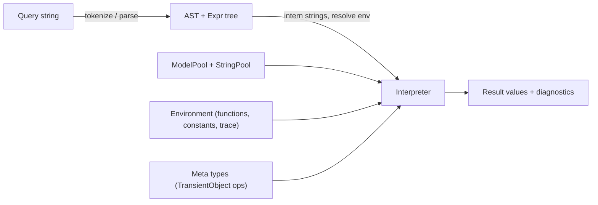
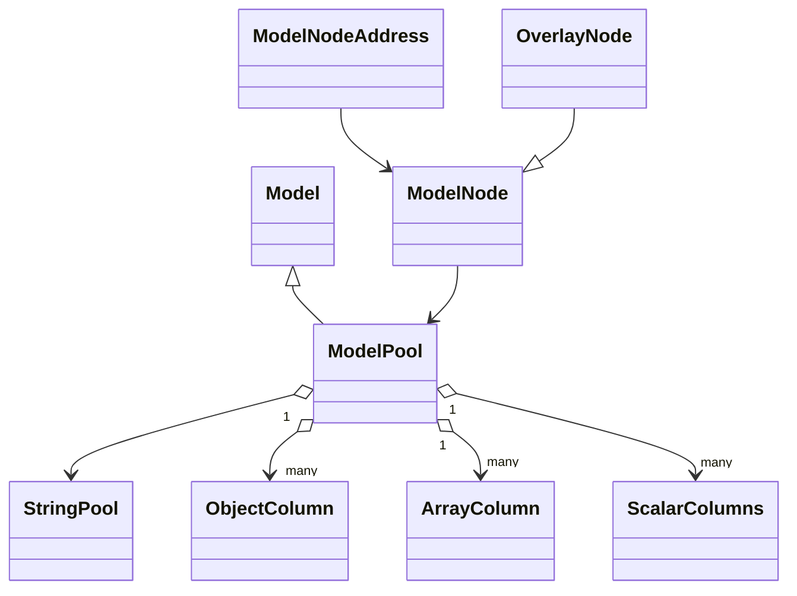
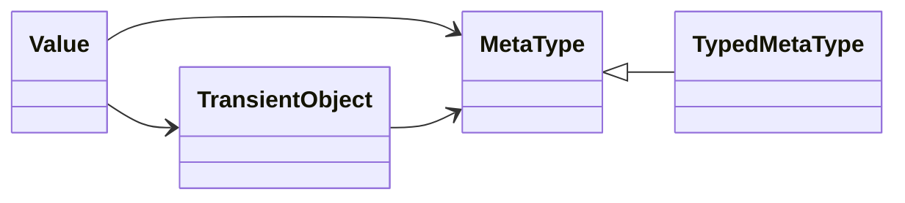
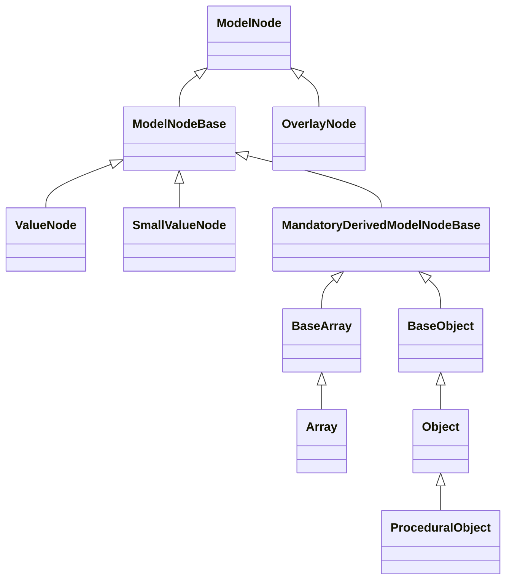
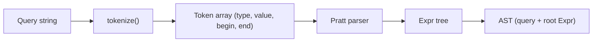
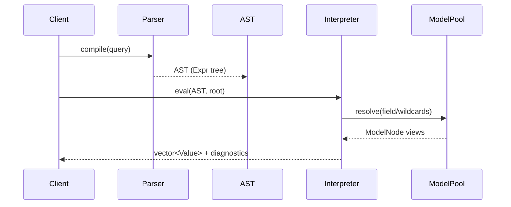
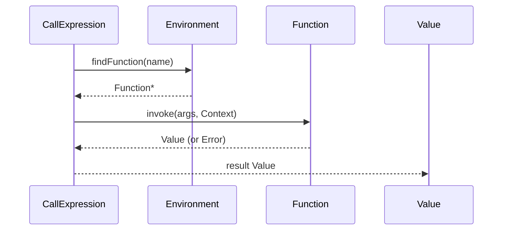
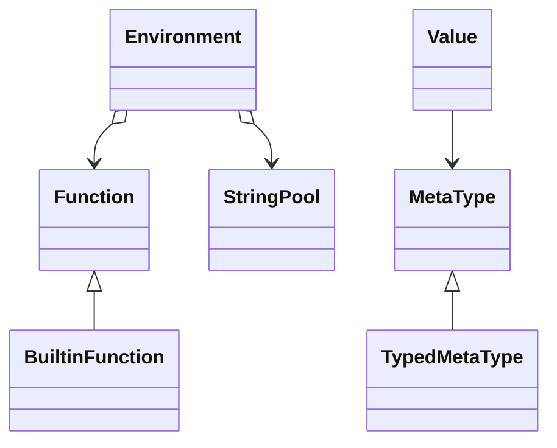
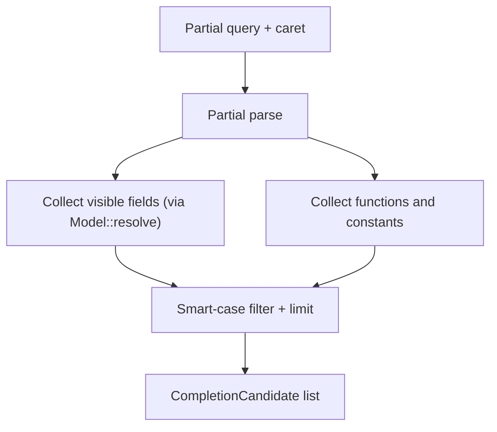

# Simfil Developer Guide

This guide describes simfil’s internal architecture: data storage, parsing and evaluation, node interfaces, and extensibility points. It is written for engineers embedding simfil or extending the interpreter and data model. Source code and issue tracking are available at [github.com/Klebert-Engineering/simfil](https://github.com/Klebert-Engineering/simfil).

## Big picture


```mermaid
flowchart LR
  Q["Query string"] -->|"tokenize / parse"| AST["AST + Expr tree"]
  AST -->|"intern strings, resolve env"| Eval["Interpreter"]
  ModelPool["ModelPool + StringPool"] --> Eval
  Env["Environment (functions, constants, trace)"] --> Eval
  Meta["Meta types (TransientObject ops)"] --> Eval
  Eval --> Values["Result values + diagnostics"]
```

- Queries are parsed into an expression tree (`Expr` subclasses).
- An `Environment` holds registered functions, constants, string pools, and debug/trace hooks.
- Meta types live on transient values and provide custom operators or unpack behaviour; they are independent of the environment.
- `ModelPool` stores data in columnar arenas with interned field names (`StringPool`).
- The interpreter walks the expression tree against `ModelNode` views, producing `Value` objects and diagnostics.

## Core building blocks at a glance

| Concept | Where | Purpose | Key types |
|---------|-------|---------|-----------|
| Model storage | `model/model.h`, `model/nodes.h` | Columnar pool for objects, arrays, scalars; backs every query. | `ModelPool`, `ModelNode`, `ModelNodeAddress`, `StringPool` |
| Runtime values | `value.h`, `types.h` | Immutable runtime data passed between expressions and functions. | `Value`, `ValueType`, `TransientObject`, `MetaType` |
| Expressions | `expression.h`, `expressions.*` | AST node classes with `ieval` implementations. | `Expr` subclasses (field, path, call, wildcard, logical, etc.) |
| Environment | `environment.h` | Registry for functions/constants, string pools, tracing, warnings, timeouts. | `Environment`, `Context`, `Trace`, `Debug` |
| Meta types | `typed-meta-type.h`, `types.*` | Custom operator/unpack implementations on transient values; not part of the environment. | `MetaType`, `TypedMetaType`, `TransientObject`, `IRangeType`, `ReType` |
| Parser | `parser.cpp`, `expression-patterns.h`, `token.cpp` | Pratt parser building `Expr` trees from tokens. | `Token`, `AST` |
| Completion | `completion.cpp` | Partial parser that offers path/function suggestions. | `CompletionOptions`, `CompletionCandidate` |
| Diagnostics | `diagnostics.*`, `error.*` | Parser/runtime errors with source spans. | `Diagnostics`, `Error`, `SourceLocation` |
| Extensibility | `function.*`, `typed-meta-type.h`, `overlay.*` | Register new functions/meta types or overlay nodes. | `Function`, `TypedMetaType`, `OverlayNode` |

## Storage model (ModelPool, nodes, strings)

At runtime, all model data resides in a `ModelPool`. A pool owns one column per node category (objects, arrays, full-width scalars, pooled strings, and, in derived pools, custom columns). Every node is identified by a compact `ModelNodeAddress` consisting of an 8‑bit column identifier and a 24‑bit index into that column. For “small” scalar types such as `bool`, `int16_t`, and `uint16_t`, the value is encoded directly into the index bits, so no separate storage is needed.

`ModelNode` is a semantic view onto a particular address within a `ModelPool`. The `model_ptr<T>` wrapper ensures that these views keep the underlying pool alive and that ownership semantics are explicit. `StringPool` provides interning for field names and pooled string values; objects store field identifiers as `StringId` rather than raw text. Multiple pools can share a `StringPool` instance, which is important for systems such as mapget that merge overlays or maintain several related tiles in memory.

Object and array members are stored in append-only arenas, exposed through `Object::Storage` and `Array::Storage`. These arenas are implemented using `ArrayArena` and guarantee that member indices remain stable as new entries are appended. An additional `OverlayNode` type allows a caller to wrap an existing node and inject additional children without modifying the underlying pool.


```mermaid
classDiagram
  Model <|-- ModelPool
  ModelPool o--> StringPool
  ModelPool "1" o--> "many" ObjectColumn
  ModelPool "1" o--> "many" ArrayColumn
  ModelPool "1" o--> "many" ScalarColumns
  ModelNode --> ModelPool
  ModelNodeAddress --> ModelNode
  OverlayNode --|> ModelNode
```

### Memory layout and addressing

`ModelNodeAddress` packs the column and index into a single 32‑bit integer. The low byte holds the column identifier; the remaining 24 bits store either an index into a column vector or, for small scalars, the encoded value itself. The helper accessors `column()`, `index()`, `uint16()`, and `int16()` centralise this decoding. An address with value zero is treated as the null address.

Objects and arrays do not embed child nodes directly. Instead, they maintain `ModelNodeAddress` references into the same `ModelPool`. This means that a child can be addressed uniformly regardless of whether it is a scalar, object, or array. Because the backing arenas are append-only, these addresses remain stable for the lifetime of the pool.

`StringPool` maintains the mapping between strings and the `StringId` integers stored in object fields. The base `Model` interface exposes `lookupStringId` so that serialization code such as `ModelNode::toJson` can recover human-readable field names. `ModelPool::setStrings` allows a pool to adopt a different `StringPool`, populating any missing field names along the way. This operation is used by higher-level components that need to merge data from several pools into a unified string namespace.

### ModelColumn

The primitive storage building block below `ModelPool` and `ArrayArena` is `ModelColumn<T, RecordsPerPage, StoragePolicy>`. A model column stores a single fixed-width record stream and exposes bulk byte operations for serialization and deserialization. The generic implementation accepts three families of types:

- fixed-width scalar types (`bool`, fixed-width integers, fixed-width enums, `float`, `double`)
- explicitly tagged external record types via `MODEL_COLUMN_TYPE(expected_size)`
- other approved native POD records that are trivially copyable and standard-layout

The column implementation assumes little-endian hosts and treats the in-memory representation as the wire representation. `bytes()` returns the canonical payload bytes for the current record stream; `assign_bytes()` and `read_payload_from_bitsery()` perform the inverse operation. For vector-backed columns this is one contiguous bulk copy; for segmented storage the same payload is copied chunk-by-chunk while preserving the same wire layout.

`RecordsPerPage` defines the number of records stored per page, not the page size in bytes. The effective page size is `RecordsPerPage * sizeof(T)`, and segmented storage requires that value to be a multiple of the record size. This keeps page boundaries aligned with record boundaries and lets callers reason about capacity in record counts instead of byte counts.

### Split pair columns with `TwoPart`

`TwoPart<A, B>` is a logical pair type used when a compound record should behave like `{A, B}` in C++ but should not pay struct-padding costs on the wire. `ModelColumn<TwoPart<A, B>>` specializes the generic column by storing the `first()` and `second()` members in two synchronized child columns. Reads and writes still happen through a pair-like ref proxy, but serialization concatenates the dense payload of the first column and the dense payload of the second column.

The main current use is object member storage. `detail::ObjectField` is defined as `TwoPart<StringId, ModelNodeAddress>`, so object fields still behave like `(name, value)` pairs while the wire payload remains dense and deterministic regardless of host padding rules.

### Value representation

`Value` is the runtime carrier for scalar and structured results:

- Scalars: `bool`, `int64_t`, `double`, `std::string`, `std::string_view`.
- Structured: `ModelNode` views (object/array) and `TransientObject` for meta types.
- `ValueType` flags guard type-safe access and drive operator dispatch; conversions are explicit (e.g., `asInt`, `asString`, `isa`).

### Transient/meta types

Meta types (e.g., `irange`) extend the language with custom operators and unpacking. `TypedMetaType<T>` supplies lifecycle hooks (init/copy/deinit) and operator dispatch (`unaryOp`, `binaryOp`, `unpack`) for a user-defined `T`. Meta instances live inside `TransientObject` values.


```mermaid
classDiagram
  direction LR
  Value --> MetaType
  MetaType <|-- TypedMetaType
  Value --> TransientObject
  TransientObject --> MetaType
```

### Constructing models (sketch)

```c++
auto strings = std::make_shared<simfil::StringPool>();
simfil::ModelPool model(strings);
auto obj = model.newObject();
obj->addField("name", model.newValue("demo"));
obj->addField("speed", model.newValue(int64_t{50}));
model.addRoot(obj);
```

### Node hierarchy and interfaces

`ModelNode` is the abstract view type shared by all concrete nodes. It offers a small, uniform interface for interrogating the model:

- `value()` returns a `ScalarValueType` when the node carries a scalar or a monostate otherwise.
- `type()` returns a `ValueType` tag (`Null`, `Bool`, `Int`, `Float`, `String`, `Object`, `Array`, or `TransientObject`).
- `get(StringId)` and `at(int64_t)` provide object-style and array-style access.
- `keyAt(int64_t)` returns the field name associated with an index, which is particularly useful when iterating objects.
- `size()` reports either the number of elements (arrays, objects) or zero (for scalars).
- `iterate(IterCallback)` visits each resolved child node in turn and is used by wildcard expressions and completion.

Most concrete nodes do not implement these functions directly. Instead, they inherit from `ModelNodeBase`, which stores the `ScalarValueType` payload and provides default implementations that return empty results. The intermediate template `MandatoryDerivedModelNodeBase<ModelType>` builds on this by providing a strongly typed `model()` accessor that returns a reference to the underlying `Model`/`ModelPool` subclass. All node types that need to call back into their pool (for example, to allocate children) derive from this template.

The main node classes are illustrated below.


```mermaid
classDiagram
  ModelNode <|-- ModelNodeBase
  ModelNodeBase <|-- ValueNode
  ModelNodeBase <|-- SmallValueNode
  ModelNodeBase <|-- MandatoryDerivedModelNodeBase
  MandatoryDerivedModelNodeBase <|-- BaseArray
  MandatoryDerivedModelNodeBase <|-- BaseObject
  BaseArray <|-- Array
  BaseObject <|-- Object
  Object <|-- ProceduralObject
  ModelNode <|-- OverlayNode
```

`ValueNode` is used for nodes whose entire content is represented by the `ScalarValueType` payload. It reinterprets the stored variant to derive a concrete `ValueType`. `SmallValueNode<T>` specializes this pattern for `int16_t`, `uint16_t`, and `bool`. For these types, the value is extracted from the address’ index bits, so no additional storage is required; the specializations of `value()` and `type()` implement these conversions.

`BaseArray<ModelType, ModelNodeType>` provides the generic implementation of array behaviour for model pools. It owns a pointer to an `ArrayArena<ModelNodeAddress, …>` and an `ArrayIndex` into that arena. The base class implements `type()` (always `Array`), `at()`, `size()`, and `iterate()` in terms of the arena. `Array` itself is a thin wrapper over `BaseArray<ModelPool, ModelNode>` that adds convenience overloads for appending scalars, which internally delegate to `ModelPool::newSmallValue` or `ModelPool::newValue` and then record the resulting address in the arena.

`BaseObject<ModelType, ModelNodeType>` plays the same role for object nodes. It stores key–value pairs as `detail::ObjectField` elements inside an `ArrayArena`; that type is currently `TwoPart<StringId, ModelNodeAddress>`, so names and child addresses are physically stored in split columns while the API still behaves like a logical pair sequence. The base class implements `type()` (always `Object`), `get(StringId)`, `keyAt()`, `at()` (interpreting the array as an ordered sequence of fields), and `iterate()`. The concrete `Object` subclass adds convenience `addField` overloads for common scalar types and an `extend` method that copies all fields from another `Object`.

`ProceduralObject` extends `Object` with a bounded number of synthetic fields. These fields are represented as `std::function<ModelNode::Ptr(LambdaThisType const&)>` callbacks in a `small_vector`. Accessors such as `get`, `at`, `keyAt`, and `iterate` first consult the procedural fields and then fall back to the underlying `Object` storage. This pattern makes it possible to expose computed members alongside stored ones without materialising them permanently in the arena.

`OverlayNode` is an orthogonal mechanism that wraps an arbitrary underlying node and maintains a separate map `<StringId, Value>` of overlay children. Calls to `get` and `iterate` first visit the injected children and then delegate to the wrapped node. The overlay itself derives from `MandatoryDerivedModelNodeBase` and uses an `OverlayNodeStorage` `Model` implementation to resolve access.

### Array arena details

The `ArrayArena` template implements the append-only sequences used by arrays and objects. Conceptually, it manages a collection of logical arrays, each of which may use one of two physical representations:

- a regular growable chunk chain backed by `heads_`, `continuations_`, and `data_`
- a singleton handle backed by `singletonValues_` and `singletonOccupied_`

Regular arrays behave like the historical arena implementation. Each logical array is identified by an `ArrayIndex` and starts with a head `Chunk` in `heads_`. If the array grows beyond the head’s capacity, the arena allocates continuation chunks in `continuations_`. Each chunk records an `offset` into `data_`, a `capacity`, and a `size`. For a head chunk, `size` also tracks the total logical length of the array; for continuation chunks, `size` is local to that chunk. The `next` and `last` indices form a singly-linked list from the head to the tail chunk.

`new_array(initialCapacity, fixedSize)` controls which representation is chosen. If `fixedSize` is `false`, even `initialCapacity == 1` creates a regular growable array. If `fixedSize` is `true` and `initialCapacity == 1`, the arena instead returns a singleton handle. That handle represents a 0-or-1 element logical array with no head chunk allocation. This is useful for storage patterns where one-element arrays are common and known not to grow later.

When a caller appends an element to a regular array via `push_back` or `emplace_back`, the arena calls `ensure_capacity_and_get_last_chunk_unlocked`. This function locates the current tail chunk (either the head or a continuation). If the tail still has spare capacity, it is returned directly; otherwise, the function allocates a new continuation chunk with capacity doubled relative to the previous tail, extends `data_`, links the new chunk into `continuations_`, and updates the head’s `last` pointer. Singleton handles do not use this growth path; they allow at most one element and reject further appends.

Element access via `at(ArrayIndex, i)` dispatches by representation. Singleton handles resolve directly against `singletonValues_`. Compact arenas resolve against the compact head metadata. Regular arrays walk the chunk list, subtracting full chunk capacities from the requested index until the index falls within the current chunk’s capacity and size. This keeps the public API uniform while allowing denser storage for the common singleton case.

The arena also supports a compact serialization mode. In that mode, `compactHeads_` stores only `{offset, size}` metadata for each regular array, while `data_` already contains a dense payload without chunk gaps. Runtime head chunks are materialized lazily from `compactHeads_` when a later mutation requires growable chunk state again. This allows serialized arenas to stay compact without forcing the mutable runtime representation onto the wire.

The higher-level iteration facilities follow the same dispatch rules. `begin(array)`/`end(array)` iterate one logical array, while the top-level arena iterator skips the sentinel head entry and also yields singleton handles. `iterate(ArrayIndex, lambda)` supports unary callbacks receiving a value and binary callbacks receiving both a value and its logical index. This is used by `BaseArray::iterate` and `BaseObject::iterate` to expose child traversal without materializing temporary containers.

Thread-safety is conditional. If `ARRAY_ARENA_THREAD_SAFE` is defined, the arena uses a shared mutex to protect growth and element access. Reads use shared locks, while mutations and compact-to-runtime materialization take an exclusive lock. Simfil itself does not require the arena to be thread-safe as long as model construction happens before concurrent evaluation, but the hooks are present for embedders that need concurrent writers.

## Parser, tokens, and AST

Simfil uses a Pratt-style parser on top of an explicit token stream. The tokenizer in `token.cpp` converts the input into `Token` structures carrying a type (`WORD`, `INT`, `OP_ADD`, …), optional literal, and the character offsets (`begin`, `end`). These spans are attached to expressions and later surface in diagnostics.

Prefix and infix parselets in `expression-patterns.h` map tokens to `Expr` nodes and encode precedence/associativity. `Parser::parsePrecedence` walks the stream, chaining parselets until no higher-precedence infix applies.


```mermaid
flowchart LR
  Source["Query string"] --> Tok["tokenize()"]
  Tok --> Tokens["Token array (type, value, begin, end)"]
  Tokens --> Parser["Pratt parser"]
  Parser --> ExprTree["Expr tree"]
  ExprTree --> ASTWrapper["AST (query + root Expr)"]
```

The result is an immutable `AST` (query string + root expression). Failures carry the offending token; higher layers translate that into `Diagnostics` entries with precise `SourceLocation`s.

## Query pipeline

From a caller’s perspective, the entry points are `compile` and `eval`. `compile(env, query, …)` tokenises/parses the query and interns identifiers through the environment’s `StringPool` so runtime lookups are cheap.

`eval(env, ast, rootNode, diagnostics)` builds a `Context` (phase flag, environment pointer, optional timeout) and drives the root expression while checking cancellation and optional debug hooks. Navigation stays model-agnostic: expressions talk only to the `ModelNode` interface (`get`, `at`, `iterate`, `size`, `keyAt`), so different pools can be swapped in without touching interpreter logic. Short-circuiting is pervasive; errors and warnings flow into `Diagnostics` when provided.


```mermaid
sequenceDiagram
  participant Client
  participant Parser
  participant AST
  participant Eval as Interpreter
  participant Model as ModelPool
  Client->>Parser: compile(query)
  Parser-->>AST: AST (Expr tree)
  Client->>Eval: eval(AST, root)
  Eval->>Model: resolve(field/wildcards)
  Model-->>Eval: ModelNode views
  Eval-->>Client: vector<Value> + diagnostics
```

### Path and wildcard semantics

- `FieldExpr` resolves `_` to the current value; other names are interned via the environment string pool. Missing fields yield `undef` during compilation and `null` at runtime.
- `PathExpr` chains access (`a.b.c`) while skipping `undef` or non-node `null` results.
- `*` iterates immediate children; `**` emits the current node and then walks all descendants depth-first.
- `{…}` keeps the input only if the inner filter is truthy. Subscripts accept integers (array) or strings (object lookup); other index types defer to meta-type-specific subscript logic.

### Control flow and short-circuiting

- `Any`/`Each` short-circuit as soon as the outcome is known. `undef` counts as false for control flow but is preserved as a value when needed for diagnostics.
- `and`/`or` return one of their operands (Lua/JS style) and short-circuit; only `false`/`null` are falsey in the operator dispatcher, but the control-flow helpers treat `undef` as false to avoid leaking unknowns into booleans.

### Function and meta-type calls (runtime)


```mermaid
sequenceDiagram
  participant Expr as CallExpression
  participant Env as Environment
  participant Fn as Function
  participant Val as Value
  Expr->>Env: findFunction(name)
  Env-->>Expr: Function*
  Expr->>Fn: invoke(args, Context)
  Fn-->>Expr: Value (or Error)
  Expr-->>Val: result Value
```

- Functions are looked up case-insensitively.
- Functions decide their own evaluation strategy (eager/lazy) and arity checks; errors are surfaced through the provided `ResultFn`.
- Meta-type operators dispatch through the `meta` pointer on `TransientObject` values.

## Environment and extension points

- **Functions** – register C++ callables in `Environment::functions` (case-insensitive). Each `Function` owns arity checks and evaluation strategy.
- **Constants** – fixed `Value`s registered in `Environment::constants`.
- **Meta types** – derive from `TypedMetaType<T>` (or implement `MetaType`) to add operators/unpack. Keep the meta instance alive (often as a static singleton) and wrap values in `TransientObject{meta}`; no environment registration is required.
- **Custom models** – derive from `Model`/`ModelPool` to add columns or override resolution. The JSON adapter (`model/json.cpp`) shows how to expose non-native trees.
- **Debug/trace/timeouts** – assign `Environment::debug` callbacks, use `Environment::trace` hooks, and set `Context::timeout` to cancel long-running evaluations.


```mermaid
classDiagram
  Environment o--> Function
  Environment o--> StringPool
  Function <|-- BuiltinFunction
  Value --> MetaType
  MetaType <|-- TypedMetaType
```

### Registering a custom function (sketch)

```c++
struct MyFn : simfil::Function {
  MyFn() : Function("myfn", /*minArgs=*/1, /*maxArgs=*/2) {}
  tl::expected<Value, Error> call(Context&, const Args& args) const override {
    // args[i] are simfil::Value; perform type checks, return Error on mismatch
    return Value::make(int64_t{42});
  }
};

Environment env(strings);
env.functions.emplace("myfn", new MyFn());
```

## Completion engine

`complete(env, query, caret, options)` returns `CompletionCandidate`s by partially parsing the query and exploring:

- Known fields from the current `ModelNode` (`fieldNames` + string resolution).
- Registered functions and upper-case constants from the string pool.
- Smart-case filtering and limit/sort controls from `CompletionOptions`.

Use this in UIs (e.g., erdblick feature search) to propose valid paths and functions while a user types; operators are not completed.


```mermaid
flowchart TD
  Partial["Partial query + caret"] --> Parse["Partial parse"]
  Parse --> ContextFields["Collect visible fields (via Model::resolve)"]
  Parse --> EnvSymbols["Collect functions and constants"]
  ContextFields --> Filter["Smart-case filter + limit"]
  EnvSymbols --> Filter
  Filter --> Candidates["CompletionCandidate list"]
```

## Summary

- Environment = functions/constants/strings/debug hooks; meta types live on transient values you construct yourself.
- The interpreter speaks only `ModelNode`; keep pools swappable and share `StringPool` when IDs must align (e.g., overlays, map tiles).
- Completion suggests fields/functions/constants but not operators; plan UI affordances accordingly.
- Use timeouts/diagnostics/trace hooks when integrating into long-running or user-facing systems.
